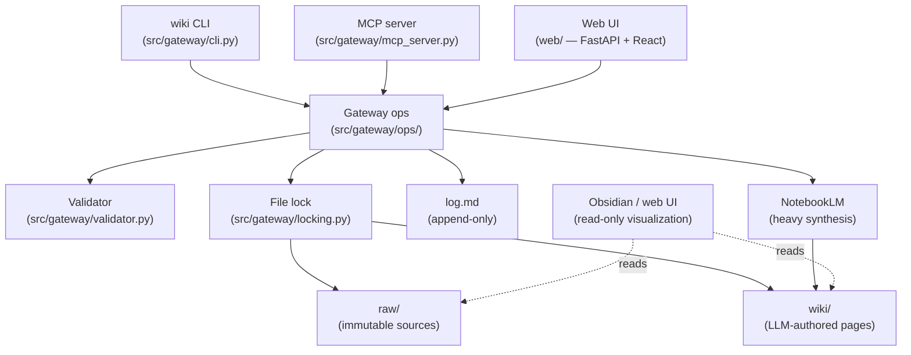

# Architecture

## Overview

This repository is a personal knowledge base built on the filesystem-as-database pattern: sources are Markdown files with YAML frontmatter in `raw/`, wiki pages are Markdown files in `wiki/`, and all mutations go through a single Python package (`src/gateway/`) that enforces citation grounding, source immutability, and provenance tracking before any write lands on disk.

NotebookLM is a heavy-synthesis service called through the gateway (never directly): the gateway sends sources to it, retrieves artifacts, and files them back to `wiki/artifacts/` with bidirectional links. Obsidian renders the citation graph over the same vault — same wikilinks, same Markdown, no separate index. The system has no queue server, no database, and no network dependency for read operations.

## Architecture diagram

All mutation paths pass through `GW → VAL → LOCK`. Direct writes to `raw/` or `wiki/` that bypass the gateway are caught by the pre-commit hook and `wiki lint`.

## Layers

**Raw layer (`raw/`).** Immutable sources. One Markdown file per ingested document; body content is never modified after ingest. Frontmatter may be updated by pipeline stages (filter score, NotebookLM corpus IDs, wiki backlinks) — these fields are enumerated in `MUTABLE_SOURCE_FIELDS` in `validator.py`. Every file has a stable `id:` field used as the citation anchor throughout the wiki.

**Wiki layer (`wiki/`).** LLM-authored knowledge. Five sub-directories: `entities/` (drugs, organizations, papers, people), `concepts/` (named ideas and mechanisms), `sources/` (one summary page per ingested source), `synthesis/` (cross-source analyses), `artifacts/` (NotebookLM outputs), and `mocs/` (maps of content per domain). Every claim in every wiki page must be followed by `[[sources/<id>]]` linking to the source page — the validator enforces this at write time.

**Gateway layer (`src/gateway/`).** The single mutator. CLI (`wiki <subcommand>`), MCP server, and web UI all delegate to gateway ops in `ops/`. Each op returns `OperationResult`; writes acquire a named file lock from `locking.py`; every mutation is logged to `log.md`. The validator runs before every write; the pre-commit hook runs `wiki lint` to catch direct writes.

**NotebookLM layer.** Heavy-synthesis service. The gateway adds sources to NotebookLM corpora via `nlm_client.py`, triggers queries and artifact generation via `research/orchestrator.py`, and files results back to `wiki/artifacts/` with bidirectional links. Agents never call NotebookLM directly — only the gateway does (CLAUDE.md hard rule #2).

**Obsidian / web UI (read-only).** Obsidian renders the wikilink graph over the same vault. The local web UI (`wiki serve`) serves a FastAPI + React SPA for browsing and research review. Both are strictly read-only consumers; they never write to `raw/` or `wiki/`.

## Invariant table

| Invariant | Where enforced | Since |
|---|---|---|
| Citation grounding: every claim must cite `[[sources/<id>]]` | `validator.validate_citation_grounding()`, pre-commit hook | M6 |
| No direct writes to `raw/` or `wiki/` | Pre-commit hook (`scripts/pre-commit`), `wiki lint --scope direct-writes` | M1 |
| Gateway write lock: one writer at a time per resource | `locking.file_lock()` — flock-based, named per operation | M1 |
| Source immutability: body of `raw/` files never mutated after ingest | `ingest.py` skip-if-exists guard; `MUTABLE_SOURCE_FIELDS` allowlist in `validator.py` | M2 |
| Prompt guard: `log.md` and `index.md` never loaded wholesale into LLM | `paths.assert_safe_for_prompt()` raises `PromptGuardError` | M47 |
| NLM discipline gate: NotebookLM only called through the gateway | Convention enforced by CLAUDE.md hard rule #2; `nlm_client.py` is the only call site | M5 |
| Slug uniqueness: no two pages share a slug within a type | `validator.validate_wiki_page_frontmatter()` slug-collision check | M3 |
| Draft citation downgrade: uncited claims in `draft: true` pages are warnings, not errors | `validator.validate_citation_grounding(draft=True)` | M6 |
| Timestamp required: entity/concept/synthesis pages must carry `created_at`/`last_updated` | `validator.validate_timestamps()` in `validate_wiki_page_frontmatter()` | M58 |
| MCP parity: every implemented CLI op has a matching MCP tool (or is marked CLI-only) | `tests/gateway/test_mcp_parity.py` — K2 gate before every merge | M42 |

## Data flow

End-to-end example: URL → `wiki ingest` → wiki source page.

1. **CLI**: `wiki ingest https://example.com/article --domain glp1`
2. **Converter** (`converters/web.py`): fetches the URL, produces canonical Markdown + YAML frontmatter as a string. Assigns a stable `id:` of the form `web-<YYYY>-<MM>-<DD>-<hash8>`.
3. **Validator** (`validator.py`): checks source frontmatter shape (`validate_source_frontmatter`). Rejects on missing required fields.
4. **Filter** (`filter/semantic.py`): loads `policies/glp1/policy.yaml`, scores the source against the domain policy via a Haiku-tier LLM call. Returns `FilterResult(score, rationale, policy_version, decided_at)`. Score written to `raw/<type>/<id>.md` frontmatter under `filter:`.
5. **Write to raw/** (`locking.file_lock("wiki-author")`): atomic write via temp-file-rename. Source is now immutable; body will never be modified.
6. **Wiki authorship** (`ops/ingest.py`): if `filter.score >= threshold_include` (default 0.70), calls `plan.apply_plan()` to write `wiki/sources/<id>.md` — a summary page with `[[sources/<id>]]` self-link and `type: source` frontmatter.
7. **Log**: `log.append("ingest", {...}, summary=...)` records the event to `log.md`.
8. **NotebookLM sync** (optional, async): `wiki nlm-sync glp1` adds the new source to the NotebookLM corpus for the domain. Next `wiki research` call can query it.

## What is explicitly not here

**No queue server.** The inbox watcher (`watcher.py`) polls `raw/` directly via filesystem events. Polling latency is acceptable for a personal knowledge base; a message queue would add an operational dependency with no throughput benefit at this scale.

**No database.** All state is plain Markdown + YAML. `git log` provides history; `grep` provides search. A BM25/vector index is deferred until the wiki crosses ~10k pages.

**No auth layer.** This is a single-user local tool. The cloud shim (`wiki auth`) issues bearer tokens for the `/api/ingest` endpoint, which is the only networked surface.

**No multi-tenant.** One operator, one vault, one NotebookLM account. The domain model (`policies/`) partitions content, but there is no user-isolation boundary.

**No LLM routing daemon.** Each gateway op that needs an LLM call makes it synchronously via `llm/client.py` (Claude CLI subprocess) or `llm/api_client.py` (Anthropic API with prompt caching). No persistent process manages the call queue.
