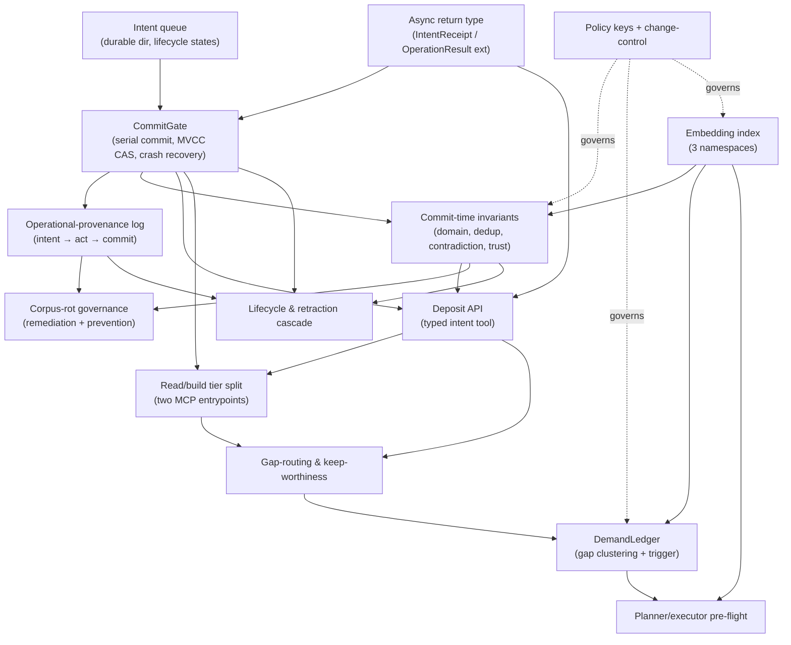
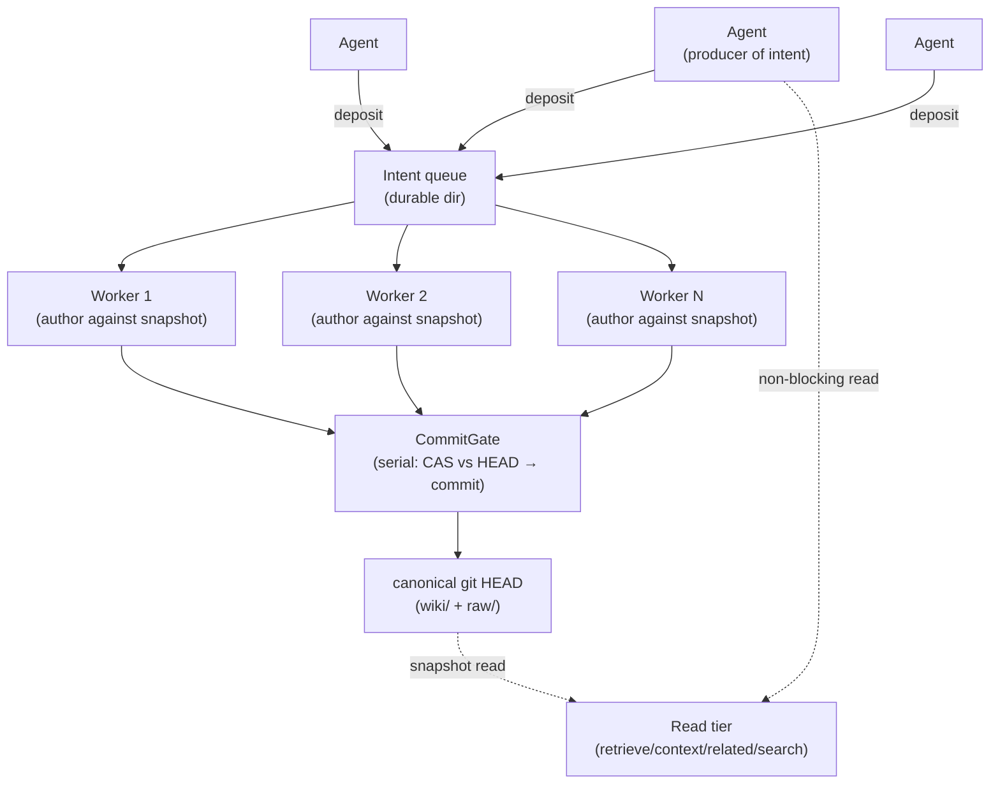
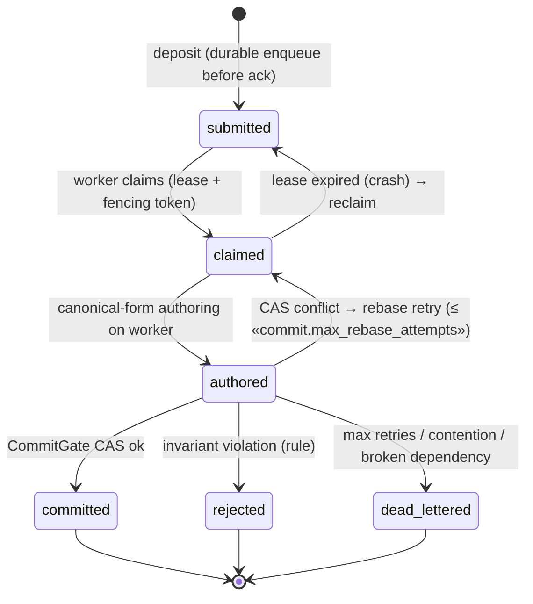

# Librarian — multi-agent runtime-RAG design

Evergreen design document. WHAT to build and WHY, expressed against the real
attachment points in `src/gateway/`. It changes only when the architecture
changes. Every tunable number, target, and progress marker lives in the companion
ledger `docs/plans/2026-06-18-librarian-multi-agent-rag-checkpoints.md`, referenced
here by guillemet key (e.g. «commit.max_rebase_attempts»); a key named here without
a matching ledger row is a defect.

Section references `§N` point to this document's structure (0–16). The settled
decisions that seeded it are cited as "decision N" (the design-prompt's
agreed-architecture list). Constraint IDs (C1–C7, I1–I4, A1–A7, G1–G8, F1–F2) are
the authoritative register `docs/plans/2026-06-18-librarian-multi-agent-rag-constraints.md`;
each is anchored to the section that resolves it, and Pass C reports the full
per-ID table.

This document is generated in three passes (§0 + §§1–8, then §§9–16, then the
ledger and self-checks). This file holds Pass A.

---

## 0. Component dependency map & build order

The system is not a new subsystem. It is a set of gates on the existing gateway
write path, a typed deposit tool over the existing MCP surface, a demand ledger, a
shared embedding index alongside the FTS index, and policy keys under
`.knowledge/policies/`. The dependency structure below is what a planning step
turns into phases; a plan that contradicts this graph is a defect.

Two components are foundational — everything else assumes them:

- **The CommitGate** (the serial commit of an intent to canonical state) underlies
  every write. No invariant — dedup, contradiction, domain resolution, trust — can
  be enforced before the gate exists, because the gate is the one place where
  "compare against current HEAD, then commit" is linearizable.
- **The embedding index** (decision 13) is a prerequisite for commit-time dedup
  (§6), demand clustering (§11), and the plan-time gap pre-flight (§12). Those three
  cannot be built before it, and it has no dependency of its own beyond the markdown
  it derives from.

**Minimal phase cut.** Each phase is a set of components with no unbuilt
dependency; the green-gate is the observable condition that must hold before the
next phase begins. The ledger's phase-boundary checkpoints key off these exact
phase names.

- **Phase 1 — Commit foundation.** Intent queue (durable directory with on-disk
  lifecycle states), async return type (§3), CommitGate (serial commit-per-intent,
  MVCC compare-and-swap, fencing, crash recovery), operational-provenance log.
  Extends `core.write_atomic` / `locking.py` / the `discharge_orphans` git-shell
  pattern; adds the commit-on-write-path behavior that does not exist today.
  *Green-gate:* the never-regress invariants hold (writes serialized at one gate,
  reads non-blocking against a committed ref, validator still rejects ungrounded
  claims); a kill-mid-reattachment test leaves `git status` clean and re-runs the
  intent; redelivering a committed intent produces no second write; every committed
  corpus change has an operational-provenance ancestor.

- **Phase 2 — Identity substrate.** The embedding index (three namespaces),
  incremental upsert on commit, shadow-swap rebuild. Adds alongside
  `search_index.py`; depends on Phase 1 (the committer upserts on commit).
  *Green-gate:* each namespace's adequacy gate passes against its own golden set; a
  rebuild-from-canonical produces a byte-equivalent index and its wall-time is
  recorded; a `retrieve` during rebuild returns complete results.

- **Phase 3 — Commit-time invariants.** Typed deposit payloads and the authorship
  workers; multi-label domain resolution; two-stage dedup adjudication (LLM-free
  committer); claim-level contradiction with auto-resolve-by-policy; trust/quality
  tiering. Extends `validator.py` and `search_index._authority_key`; depends on
  Phases 1–2. *Green-gate:* dedup precision/recall meet the golden merge/link/distinct
  set; two concurrent same-entity intents both survive (write-skew test); a phantom
  collision attaches citations to the canonical page with zero broken wikilinks; any
  `_authority_key` change passes `eval-retrieval --compare`.

- **Phase 4 — Tiered agent surface.** The two-MCP-entrypoint read/build split; the
  deposit consumer contract (status-query, wait hint, backpressure signal);
  per-producer telemetry. Extends `mcp_server.py`; depends on Phases 1, 3.
  *Green-gate:* the read-tier server's registered set equals exactly the
  read-classified op set (parity test); an agent author can code the wait loop from
  the spec; lock acquisition is bounded, never indefinite.

- **Phase 5 — Lifecycle & demand governance.** Corpus-rot remediation sweep;
  retraction cascade (Option A `revert-resolution` + transitive `synthesizes:`
  closure); the DemandLedger and its canonicalization trigger; the gap-routing
  ladder and keep-worthiness gates; the planner/executor pre-flight. Depends on
  Phases 1–4. *Green-gate:* a source → synthesis-A → synthesis-B chain flags both on
  retraction; the lost-update claim-conservation pass accounts for every committed
  intent's claims; demand clusters meet the purity gate; remediation de-paths nothing
  reachable from the provenance graph.

---

## 1. Problem statement & objective

The wiki today is authored and read by a human-in-the-loop operator through the
`wiki` CLI and a flat MCP surface. The objective is to make it a **runtime RAG
surface for a fleet of the owner's own agents**, intra- and inter-project: agents
read it to ground their work without a human in the loop, and write grounded
knowledge back through the gateway so the corpus compounds with use.

Three requirements are coupled and must hold together:

1. **No-HITL grounded reads.** An agent grounds an answer by calling the retrieval
   surface directly, with no operator step, and gets a bounded, cited context block.
2. **Read/write compounding.** What one agent learns and deposits becomes available
   to ground the next agent's work — the corpus is context-optimization
   infrastructure, not a static reference.
3. **Multi-agent safety.** Concurrent reads and writes from many agents never
   corrupt the git tree and never silently overwrite one agent's contribution with
   another's.

Two failure modes are prevented by construction:

- **Git-tree corruption / silent overwrite.** Concurrent writers to one branch
  race on `.git/index.lock` and on multi-file working-tree state; a lost update on
  a concurrent same-entity merge raises no exception (§5, §6, F1).
- **Corpus-rot at near-enterprise scale.** Duplication, orphaning, tagging-drift,
  contradiction, provenance-quality decay, and taxonomic fragmentation accumulate
  silently under many writers (§8).

**Success condition (observable).** Many agents deposit concurrently; every
deposit reaches a terminal disposition discoverable by its `intent_id`; the working
tree is never left dirty by a crash; `wiki lint` reports zero broken wikilinks and
zero de-pathed citation targets after concurrent merges; and the golden retrieval
set, resolved through the merge-map (§16), does not regress.

**Confidentiality posture.** The corpus is an **open shared substrate** across all
of the owner's projects. Project and domain are organizing tags, not access
boundaries; originating-project identity is telemetry only (§3). The accepted risk
is plain: one project's deposited knowledge can surface in another's grounding.
That is acceptable because all projects are the owner's. The revisit trigger is a
single concrete event — a project introducing third-party-confidential material —
at which point project-isolation moves from deferred (§15) to required. No isolation
is built now.

---

## 2. Architectural thesis

**Single serialization point for writes, not a single process** (decision 1). What
must be singular is the linearization of commits to canonical state, not the number
of librarian instances. The concurrency model is optimistic / MVCC: research,
authorship, validation, and dedup-similarity search all run concurrently against a
corpus snapshot; only the commit is serial. The topology is N librarian workers and
one commit gate.

Multiple independent committers are rejected (decision 1): concurrent writers to
one branch corrupt the git index (`.git/index.lock` already serializes git itself,
so a second committer either blocks or fails), and partitioned committers cannot
enforce the global invariants — dedup and contradiction — that span domains. The
serial gate is the throughput ceiling by design. This document does not claim it is
"sub-second" or "never a bottleneck"; its latency is a measured liveness metric
(§16, ledger «liveness.commit_p50» / «liveness.commit_p99»).

Reads are non-blocking against committed snapshots. A runtime read resolves at a
git ref / commit — an atomic snapshot — rather than the live working tree, which
can be mid-multi-file-write. This is the read-your-own-writes boundary made precise
in §12.

**The integrity boundary (corrected).** There is **no single transaction** across
the three stores — the markdown working tree, the FTS5/embedding index, and the git
object store. This design does not claim "single logical transaction" or
"database-grade integrity." The accurate model:

- **Markdown is canonical.** It is the source of truth; `git log` is its history.
- **The index is derived, rebuildable, and never on the integrity-critical path.**
  `search_index.py` already embodies this — gitignored, self-healing on read, no
  write-path hook so an index failure cannot break a write (ARCHITECTURE.md
  "Retrieval layer"). The embedding index (§13) inherits the same discipline.
- **`git commit` is the only atomic primitive.** Commit ordering is: write the
  markdown working-tree files → `git commit` (atomic) → update the derived indexes.
  Crash recovery is defined at each boundary (§5): a crash before commit is undone
  by resetting the working tree to HEAD; a crash after commit but before index
  update self-heals on the next read (FTS) or incremental upsert (embeddings, §13).

**Migration delta from current code.** Committing as part of the write path is net
behavior. Today only `discharge_orphans.py` shells git — `_git_commit_synthesis_drafts`
runs `git add -- <explicit files>` then `git commit` (`ops/discharge_orphans.py:110`).
The general write path (`core.write_atomic` + `locking.file_lock`) writes the
working tree and stops; commits are a separate human `git` step. The CommitGate
generalizes the `discharge_orphans` pattern to every intent and makes it the single
committer. This is the largest single delta in the design.

**Acceptance criteria.** A runtime read issued during an in-progress multi-file
merge returns results consistent with a single committed HEAD, never a half-written
working tree — verified by a test that reads while a worker holds un-committed files
on disk. Deleting `.index/` and any embedding store, then issuing any read, returns
correct results after self-heal/rebuild, proving the index is off the integrity
path. No code path asserts a cross-store transaction.

---

## 3. Librarian model & the deposit API

Agents are **producers of intent** (decision 3). An **Intent** is a declarative,
immutable, content-addressed record of what an agent wants to become true in the
corpus. Agents never write the tree, never commit, never resolve conflicts. The
Intent is also a **callable API**, not only a data structure.

**Attachment point.** A net deposit tool registered in `mcp_server.py` alongside
the existing `@mcp.tool()` functions (the server is a flat `FastMCP` instance,
`mcp_server.py:37`). Adds-alongside the existing ops; the intent it produces is
enacted by the CommitGate (§5), not by the tool call.

### 3.1 The intent schema and the deposit contract

The deposit tool's payload is a typed Intent (the page-type-specific shapes are §4).
Every Intent carries:

- A **content-addressed `intent_id`** — a hash over `(payload, originating identity,
  intent semantics)`. It is the idempotency key (decision 3, C2): re-presenting the
  same logical deposit yields the same `intent_id`, and the CommitGate is a no-op on
  an already-committed `intent_id`, returning the prior disposition.
- The **originating agent / project / session identity**, self-declared and
  unauthenticated. The MCP surface is single-user and cooperative, not adversarial
  (decision 3). The consequence is stated plainly: identity telemetry disciplines a
  buggy producer, not a malicious one. Any trust the agent self-reports is advisory
  and never sets a precedence tier (§6, G5).
- The **HEAD snapshot** (a git ref/OID) the intent was authored against — the basis
  for the MVCC compare-and-swap at commit (§5).
- An optional **dependency reference** to an antecedent `intent_id` (§5, C6).

**Synchronous return (A5, foundational).** Commit is asynchronous, so the deposit
call cannot return paths-touched. It returns an **acceptance receipt**: the
`intent_id`, a `disposition` of `queued` (or `rejected:overloaded` under
backpressure, §3.3), and a `retry_after` hint. The shape extends the existing
`OperationResult` (`core.py:84`) with optional `intent_id` / `disposition` /
`retry_after` / `canonical_path` fields, OR is a sibling `IntentReceipt` type;
either way `_serialize` (`mcp_server.py:101`) is extended to surface the new fields
and existing consumers tolerate their absence (the current `_serialize` reads a
fixed field set, so additive optional fields do not break it). The choice between
extension and sibling type is a §0 Phase-1 implementation detail constrained by the
parity test.

**Status-query op (A1).** A separate read-tier op (§7) maps `intent_id` → terminal
disposition, a typed union: `committed → path`, `merged → canonical-path` (a
*different* page than the agent named, §5), `rejected → rule`, `quarantined → queue`,
`dead-lettered → reason`. On a non-terminal response it returns a `retry_after` /
poll-interval hint (A1). There is no push/callback in the stdio MCP surface — the
agent polls. After a bounded total wait («deposit.max_wait») the agent proceeds on
carried-forward content (§12, A4); an optional `deposit_and_wait` convenience op
blocks up to that bound. An agent author can write the wait loop from this contract
alone.

### 3.2 The intent lifecycle state machine

The lifecycle is a durable state machine, recorded as on-disk facts so it survives a
watcher/worker restart (decision 14; the current `watcher.py` holds pending work in
an in-memory `_pending` dict, `watcher.py:78`, and loses events fired while down).

- **Durable enqueue before ack** (decision 3): the deposit is persisted to the queue
  before the synchronous receipt returns, so an accepted `intent_id` is never lost to
  a crash.
- **Claim with lease and fencing token** (C3): claiming a `submitted` intent issues a
  monotonic **fencing token** and a renewable visibility **lease** («commit.lease_ttl»).
  A live worker renews the lease by heartbeat so legitimately long authorship does
  not trigger spurious reclaim; a crashed worker's lease expires and the intent
  returns to `submitted` for reclaim. The CommitGate rejects any commit whose
  fencing token is not the highest issued for that `intent_id`, so a resurrected slow
  worker cannot overwrite the reclaimer's commit.
- **Bounded retry → dead-letter** (C4): the rebase-on-conflict loop (§5) is bounded
  by «commit.max_rebase_attempts»; exceeding it dead-letters with a `contention`
  reason. A broken causal dependency (C6) dead-letters with `broken-dependency`.
- **Restart recovery scan**: on startup the committer scans committed history for
  applied `intent_id`s (C2) and the queue for `claimed` intents whose lease has
  expired, reclaiming them; in-flight working-tree state is reset to HEAD (§5, C1).

### 3.3 Operational provenance and per-producer telemetry

The intent queue is a write-ahead log that yields an **operational-provenance
graph** (corpus-change → intent → agent), distinct from content-provenance
(claim → source, the existing `[[sources/<id>]]` graph). It records not only
outcomes but the **decision basis** sufficient to audit and replay a
canonicalization without re-running the LLM (decision 3): the policy/threshold
version in force, the dedup similarity score and candidate referents considered, the
contradiction/trust determinations, and the merge/rebase branch taken (§5). This is
what makes a resolution reversible (§9, G1) and a lost update detectable (§6, F1).

**Per-producer telemetry (A7).** Acceptance / rejection / dedup-merge rates and
time-in-queue are tracked per originating identity, with alarms on: a
rejection-rate spike, a dedup-merge-to-existing spike (a producer contributing only
non-novel content), and deposit-silence (a previously-active producer dropping to
zero). These are named failure-mode detectors (§16) — a misbehaving producer is
caught at the source.

**Migration delta.** No operational-provenance graph exists today; the closest
artifact is the append-only `log.md` event stream (`log.py`), which records events
but not a queryable decision-basis record per corpus change. The provenance log is
adds-alongside `log.md`, not a replacement.

**Acceptance criteria.** Re-presenting a committed `intent_id` returns the prior
disposition and writes nothing (idempotency test). A status-query on every terminal
state returns the typed disposition, and on `merged` returns a canonical path
different from the deposited target. Killing a worker mid-authoring returns its
intent to `submitted` and a fresh worker re-runs it; the resurrected original cannot
commit (fencing test). Every committed corpus change resolves to exactly one
operational-provenance node carrying its decision basis, and a canonicalization
replays from that node without an LLM call.

---

## 4. Authorship contract

**Thin authorship, structured-claim intent** (decision 4). The boundary between
agent and librarian is **canonical-form authorship, not content**. Agents own
content — what is true, why it matters, the sources, the framing. The librarian owns
form — the canonical page that is schema-conformant, citation-grounded, deduped,
wikilinked, and validated. Authorship discipline lives in one place so it cannot
diverge across the fleet.

**Attachment point.** The librarian's authoring step reuses the existing authorship
machinery — `plan.apply_plan` / `ops/ingest.py` / `ops/apply_plan.py` and the
validator (`validator.py`) — but runs it on a **worker against a snapshot** rather
than inline under a global lock. Extends the existing authorship path; the migration
delta is where it runs and under which lock (below).

Payload richness scales with the agent's unique cognitive value, by page-type
(decision 4):

- **Source intent** — a URL/ref plus extracted claims/quotations with provenance.
  The librarian authors the `wiki/sources/<id>.md` page fully. (Today's `wiki ingest`
  is the closest path; under the deposit model, ingest becomes a source-intent so it,
  too, carries an operational-provenance node — C7.)
- **Entity/concept intent** — assertions plus their sources. The librarian authors a
  new referent page or merges the assertions into an existing referent (§6 dedup).
- **Synthesis intent** — the agent's draft reasoning, the question that shaped it, and
  the source set. The librarian canonicalizes: grounds every claim to
  `[[sources/<id>]]`, formats, dedups, links, validates — it does not re-synthesize
  from scratch.

In all three, the agent submits intent payload, never a committed page;
canonical-form authoring runs on a parallelized worker; only commit is serial.

**Rejected alternatives** (compressed, decision 4). *Thick intent* (agents author
finished pages) re-imposes derivative authorship on execution agents — the drift and
context-pollution the producer-of-intent model removes — and forks the authorship
implementation across N agents. *Raw-dump thin intent* discards the structure the
agent already paid to produce. The chosen middle keeps authorship single-sourced
while preserving the agent's structured output.

**Migration delta from current code.** The current global `wiki-author` flock
serializes **all** wiki authorship, not just the commit: `locking.file_lock("wiki-author")`
is the single write barrier for "any gateway op that mutates a `wiki/<type>/<slug>.md`"
(`locking.py:27`), and it is a plain `flock(LOCK_EX)` with no timeout (`locking.py:75`).
The agreed N-worker concurrent-authorship model requires **narrowing or replacing**
this lock: authoring must run concurrently (no global authorship lock), and only the
CommitGate's commit step holds a serial barrier. This is flagged again under §5
(the commit mutex) and §3.3 (A3, the no-timeout block becomes a bounded acquisition).

**Acceptance criteria.** Two source intents for different domains author
concurrently (no global authorship lock serializes them), observable as overlapping
authoring spans in the operational-provenance log. A synthesis intent's committed
page cites only sources from the submitted source set, with every claim grounded —
the librarian added no ungrounded claim of its own (validator passes; a diff of
deposited-claims vs committed-claims shows canonicalization, not re-synthesis).

---

## 5. Concurrency & commit protocol

This is the highest-risk surface; it is specified in full (decision 5). MVCC
requires a concrete compare-and-swap, not "re-validate against HEAD."

**Attachment point.** The CommitGate is a net component that owns the serial commit.
It wraps `core.write_atomic` (per-file `os.replace`, `core.py:121` — there is no
multi-file atomic primitive, C1) for the working-tree writes and generalizes the
`discharge_orphans._git_commit_synthesis_drafts` git-shell (`ops/discharge_orphans.py:110`,
which already stages an explicit file list with `git add --`, never `-A`) into the
one committer. It holds a **commit mutex** (a sanctioned lock name added to
`locking.LOCK_NAMES`, replacing the global `wiki-author` barrier for the commit step
— §4 migration delta) and shares `.git/index.lock` with watcher/poller writes (C7).

### 5.1 Read/write set and compare-and-swap

Each intent declares a **read/write set**: the target page, the dedup-target entity,
and the backlink rows in cited sources. At commit, for each written page the gate
compares the page's content-hash / git blob OID at the authored snapshot against
current HEAD. Three cases, named:

1. **No overlap** → commit.
2. **Same page, mergeable claims** → rebase the structured payload onto current HEAD
   and re-run the authorship merge step (§4), NOT a blind overwrite, then re-enter the
   CAS. Bounded by «commit.max_rebase_attempts» (C4) before dead-letter with a
   `contention` reason; the gate tracks per-entity rebase-retry count and
   oldest-rebased-intent age (ledger liveness).
3. **Same page, contradictory edit** → dead-letter with reason (the contradiction is
   recorded; §6 governs claim-level contradiction handling).

### 5.2 Concurrent same-entity write-skew (C5)

Two intents each adding a non-conflicting claim to one entity, both authored against
the same snapshot, must **both survive**. There is no slug collision to catch a lost
update here — both target the same existing slug — so an unhandled case is silent
corruption, not an error. The merge case (5.1 case 2) handles this: the second
intent to reach the gate rebases its claim onto the first's committed page. A new
referent first-minted under two different surface names against the same snapshot
(C5) is caught at the **serial re-check**: the commit phase searches the entity
namespace (§13) as updated within the current serialization window **plus** the
in-flight batch's `canonical_name`/`aliases`, so the second resolves to the first
(merge), not a duplicate page.

### 5.3 The merge-reattachment protocol

When resolution merges page B into canonical A — all inside the one commit — the gate
performs, atomically in that commit:

- Rewrite every inbound `[[…B]]` wikilink to A.
- Update bidirectional `wiki_pages:` backlinks in every raw source B cited — drop B,
  add A — per WIKI.md §5.4 (the gateway already maintains `wiki_pages:` integrity;
  this extends it to the merge case).
- Rewrite `synthesizes:` / `## Included works` references from B to A
  (`validator.validate_synthesizes_integrity`, `validator.py:594`, enforces the
  mirror; the rewrite must keep it consistent).
- Leave a **tombstone redirect** at B's slug so stable external path-references
  resolve to A.
- Record the **pre-merge reattachment set** in the provenance node (which links,
  backlinks, and `synthesizes:` refs were rewritten B→A) so the merge is reversible
  without git archaeology (G8).

**Migration delta.** `wiki_pages:` backlink maintenance exists (WIKI.md §5.4) but
only for the single-page citation path; the multi-file, in-one-commit merge
reattachment is net behavior built on the existing backlink updater. Tombstone
redirects do not exist today.

### 5.4 Idempotency, ordering, and causal dependencies

The gate is **idempotent on `intent_id`** (decision 5): re-presenting a committed
intent is a no-op returning the prior result. Idempotency is keyed off **committed
state, not the queue status file** (C2): the `intent_id` is written into the commit
itself — a commit-message trailer and/or an `applied_intents` record updated in the
same commit — and recovery resolves disposition by scanning committed history, which
cannot lag the commit (the status file can lag by one crash).

The watched-directory queue provides **no total order**. If intent B depends causally
on the page intent A creates, B carries an explicit dependency reference (§3) and the
committer defers B until A commits; if A reaches a terminal non-committed state, B is
dead-lettered `broken-dependency` (C6); dependency cycles are rejected at submit, and
deferred-intent age is tracked (C6).

### 5.5 Crash recovery (C1, F1)

The N-file merge-reattachment writes precede the atomic git boundary, and
`write_atomic` is per-file, so a crash mid-reattachment can leave a partially-written
working tree. Recovery is: on restart, before re-claiming any in-flight intent,
`git reset --hard HEAD` + `git clean -fd` to HEAD; then re-run the intent from
`claimed` (its lease has expired, §3). Because the markdown is canonical and the
indexes are derived, no index state needs recovery — the FTS index self-heals on read
and the embedding index incrementally upserts on the next commit (§13).

**Lost-update detector (F1).** A lost update raises no exception and breaks no link,
so it is named to be caught: every claim in a committed intent's payload must resolve
to a claim on the canonical page or to an auditable resolution act (a merge or
contradiction record). A periodic **claim-conservation reconciliation** re-derives
the claim set from committed history and alarms on any intent whose payload claims are
unaccounted-for. This is a §16 taxonomy bad state with this pass as its detector.

**Acceptance criteria.** Two intents adding distinct claims to the same entity
against the same snapshot both appear on the committed page, with zero broken
wikilinks per `wiki lint` (write-skew test). Two intents minting the same referent
under different names commit as one page (the second merges), zero duplicate-referent
pages per `wiki lint --scope dedup` (C5). A phantom collision at commit attaches
citations to the canonical page rather than minting a duplicate (integration test
submitting two colliding intents; zero broken wikilinks post-merge). Killing the
committer mid-reattachment leaves `git status` clean post-restart and re-runs the
intent from `claimed` (C1). The claim-conservation pass over a committed batch
reports zero unaccounted-for payload claims (F1). Sustained contention on one entity
makes progress or dead-letters with `contention`; it never spins forever undetected
(C4).

---

## 6. Commit-time invariants

Enforced by the single committer, extending the validator's enforcement model
(`validator.py` runs before every write per ARCHITECTURE.md "Invariant table").
These are gates on the CommitGate's serial phase, not a new subsystem.

**Citation-grounding** — exists today (`validator.validate_citation_grounding`,
`validator.py:547`, with the draft downgrade); the CommitGate enforces it on every
non-draft intent. Unchanged in substance; the delta is that it now runs at the gate
for deposited intents rather than inline under the global lock.

**Domain-resolution — multi-label** (decision 6). The `domains:` field is
list-valued (WIKI.md §3.1; `search_index.py` already reads list-valued `domains` and
folds a legacy single `domain`, `search_index.py:172`). A deposit resolves to
**one-or-more** live domains; multi-domain deposits are first-class. Quarantine only
when the resolver returns the empty set — never untagged-by-default. *Migration
delta:* resolution-to-a-set at commit is net; today domain is assigned at ingest from
a CLI flag.

**Dedup — two-stage decision, not a threshold** (decision 6, I1 KEYSTONE):

- **Stage 1 (blocking, concurrent, on the worker):** embedding-NN against the entity
  namespace (§13) plus alias/slug exact-match generates merge candidates. Only the
  blocking distance band is a tunable («dedup.blocking_nn_threshold»).
- **Stage 2 (adjudication):** a **deterministic, LLM-free** precedence procedure
  decides among {merge, link-as-related, keep-distinct} over `(entity_kind` match,
  `alias`/`canonical_name` exact-or-normalized match, `domain` overlap, blocking-NN
  distance band`)`. Cross-kind candidates (drug vs concept, person vs paper) are never
  merged; aliases are authoritative for same-referent matches embeddings miss. Any LLM
  judgment runs **on the worker against the snapshot** and emits a *recommendation*;
  the committer re-validates it deterministically against HEAD — **never a model call
  in the commit critical section** (I1). Same inputs → same verdict (replay test).

This is the keystone: the serial phase must be replayable from logged inputs, which
forbids nondeterminism (an LLM call) inside it. *Migration delta:* slug-uniqueness is
checked today (`validator.validate_slug_uniqueness`, `validator.py:663`), but
embedding-NN blocking and the adjudication procedure are net; they add-alongside the
slug check.

**Contradiction — claim granularity** (decision 6). Detected at claim level (a
deposited claim vs existing claims about the same referent, resolved via the dedup
index), not page-against-page. Materialized as a CiTO `disputes`/`confirms` edge
(WIKI.md §5.6; the validator already knows the 8-verb CiTO subset,
`validator.validate_citation_verbs`, `validator.py:702`) plus a flag. Per the owner
decision it is **auto-resolved by policy rule** (trust-tier precedence, then
recency, «contradiction.precedence»), and the resolution is recorded as an auditable
provenance act (inputs, rule applied, policy version) — the basis for reversal (§9,
G1). *Attachment point:* extends the existing `contradictions_log.py` /
`ops/contradiction*.py` machinery, which already detects and logs contradictions;
the delta is auto-resolution-by-rule with a reversible provenance act.

**Trust/quality tiering** (decision 6, G5). Sources carry a trust dimension. The
tier used in contradiction precedence is **server-derived** — source-type default
plus filter score, auditable and logged (G5); agent self-reported trust is **advisory
only and never sets the precedence tier** (this closes the buggy-agent-inflates-trust
poison vector under cooperative identity). Trust attaches to `_authority_key` in
`search_index.py:422` as a **down-weight** («trust.weight_coefficient»), never a
silent exclusion. The rich-get-richer loop (trust-weight × inbound-link authority →
suppression → "no demand") is braked by a **retrieval-eligibility floor**
(«trust.retrieval_eligibility_floor»): trust is a tiebreaker, never a gate, so a
low-trust page stays retrievable. *Migration delta + gate:* `_authority_key` today
blends BM25, tier, inbound-authority, page-kind, and a draft penalty
(`search_index.py:422`); adding a trust term changes ranking, so **any change to
`_authority_key` must pass `eval-retrieval --compare` before merge** (§16; the golden
set is the governor per ARCHITECTURE.md invariant table).

**Acceptance criteria.** A multi-domain deposit commits with all resolved domains in
`domains:`; a no-domain-resolvable deposit is quarantined, not committed untagged
(domain test). The commit-phase dedup re-check is LLM-free and produces the same
verdict on the same logged inputs (replay test). A cross-kind candidate pair is never
merged (adjudication test). A claim-level contradiction materializes a `disputes`
edge and an auto-resolution provenance act naming the rule and policy version; the
down-weighted loser remains retrievable (eligibility-floor test). A self-reported
trust value never changes the precedence tier (G5 test). Any `_authority_key` change
that regresses the golden set fails the merge (`eval-retrieval --compare` gate).

---

## 7. The read/build tier boundary

Split the surface into a **runtime read tier** (LLM-free, bounded, idempotent,
side-effect-free: `retrieve`, `context`, `related`, `search`) and a **build/deposit
tier** (token-spending or writing: `answer --file`, `query`, `research`, `ingest`,
deposit) (decision 7).

**Attachment point + migration delta.** The current MCP server registers a **flat**
tool set (`mcp_server.py` — a single `mcp = FastMCP(...)`, `mcp_server.py:37`, with
~60 `@mcp.tool()` registrations and no per-caller identity), so "an agent physically
cannot invoke a build tool" is false in-process today. The split is enforced by
exposing **two MCP entrypoints**: a **read-tier server** that registers only the
read-classified tools, and a **full server**. An agent's MOUNT configuration (which
server it connects to) determines its capability. In-process role-gating on the flat
server is net and not available today; the two-server mechanism is the design.

**Op-to-tier classification (A2).** Every registered `wiki_*` tool is classified
read / build / not-exposed by the rule **side-effect-free AND token-free → read,
else build**. So `filter` (read-only but LLM-spending) and `answer` without `--file`
(LLM-spending) are **build-tier**, not read-tier. `CLI_ONLY` (`mcp_server.py:52`) is
**not a tier** and must not be reused as one — it is the set of ops with no MCP
wrapper at all (`watch`, `mcp-serve`, `serve`, `migrate`, `demote-domain`,
`eval-retrieval`). The read-tier server's registered set **equals exactly** the
read-classified set, verified by a parity-style test mirroring the existing
`tests/gateway/test_mcp_parity.py` (which already asserts CLI↔MCP parity).

**Mixed-trust mounting.** An agent that needs both tiers mounts the full server; an
agent that should only read mounts the read-tier server. There is no per-call
elevation — capability is mount-time, matching the stdio MCP model.

**Ladder reconciliation across tiers.** The gap-routing ladder (§10) spans tiers:
`retrieve` is read-tier; `answer` and web fallback are build-tier. A read-tier-only
agent executes only the `retrieve` rung; when it bottoms out (the corpus is thin), it
cannot self-escalate to `answer` — it either hands off to a build-tier-capable agent
or its mount is upgraded. §10 specifies the bottom-out behavior; this section fixes
which rungs each mount can execute.

**Principle.** Any invariant that depends on an agent *reading* `CLAUDE.md` is a
latent bug under autonomy. Promote it into the tool surface where the surface
enforces it — the tier split is the first instance (a read-only agent cannot deposit
because the tool is absent from its mount, not because a doc told it not to).

**Acceptance criteria.** The read-tier server exposes exactly the read-classified
ops and no build/write op (parity test). A read-tier-mounted agent calling a
build/deposit tool gets a tool-not-found error, not a silent no-op. The
classification rule applied to every registered tool produces a stable read/build
label set with no tool unclassified.

---

## 8. Corpus-rot governance

The rot taxonomy, each failure with its enforcement point (decision 8):

- **Duplication** → entity-resolution adjudication (§6).
- **Orphaning** → quarantine if no inbound citation.
- **Tagging-drift** → mandatory multi-label domain resolution (§6).
- **Contradiction** → claim-level detect + auto-resolve (§6).
- **Provenance-quality decay** → trust-weighted ranking (§6).
- **Taxonomic fragmentation** → concept-space coherence under many writers
  (near-synonym concepts, inconsistent `entity_kind`/tag vocabularies, granularity
  drift). **Prevention** is the dedup adjudicator's link-vs-new-page decision (§6)
  consulting existing aliases and sibling concepts; **detection** is a standing lint
  flagging high-mutual-similarity concept clusters that lack `aliases:` / Related
  edges (extends `ops/lint.py`; the embedding entity namespace supplies the
  similarity, §13).

**Prevention vs remediation are different mechanisms.** Prevention is the commit
gates (§6) — they stop new rot at write time. Remediation is a **one-time sweep** that
re-scores the existing untagged/orphan mass and **de-paths** (does not delete)
garbage. The two must not be conflated.

**The no-de-path rule (G6, strengthened).** The remediation sweep must not de-path
any page reachable from the operational-provenance graph: specifically any page that
is a **citation target** (cited by `[[sources/<id>]]`), OR a **non-reverted
resolution-act input**, OR a **tombstone/merge referent with live inbound
path-references**. The distinction "no inbound *wikilinks*" ≠ "no inbound *citations*"
is load-bearing — a page with zero inbound wikilinks but a live citation is **not**
an orphan and must survive. *Attachment point:* `inbound_counts` /
`related_pages` in `search_index.py` supply wikilink inbound counts, but citation
targets live in `raw/` `wiki_pages:` backlinks and the provenance graph; the
remediation reachability check reads all three.

**De-pathing flows through the CommitGate as an intent** — provenanced and reversible
— never a direct tree mutation (decision 8). This keeps "every corpus change has an
operational-provenance ancestor" true even for cleanup (C7).

**Migration delta.** A remediation sweep over the existing untagged/orphan mass does
not exist; the closest precedent is `ops/discharge_orphans.py` (which authors
synthesis for orphaned *sources*, a different operation). The de-path-as-intent path
is net and built on the CommitGate.

**Acceptance criteria.** The remediation sweep de-paths a genuinely orphaned,
uncited page but leaves a zero-inbound-wikilink page that is a live citation target in
place (the citation-target survival test). Every de-path appears as an
operational-provenance node and is reversible by re-pathing (no direct tree
mutation). The fragmentation lint surfaces a high-mutual-similarity concept cluster
lacking `aliases:`/Related edges. No remediation action removes a page reachable from
the provenance graph (G6 reachability test).

---

_End of Pass A (§0 + §§1–8). Pass B appends §§9–16; Pass C writes the ledger and
runs the three self-checks._
