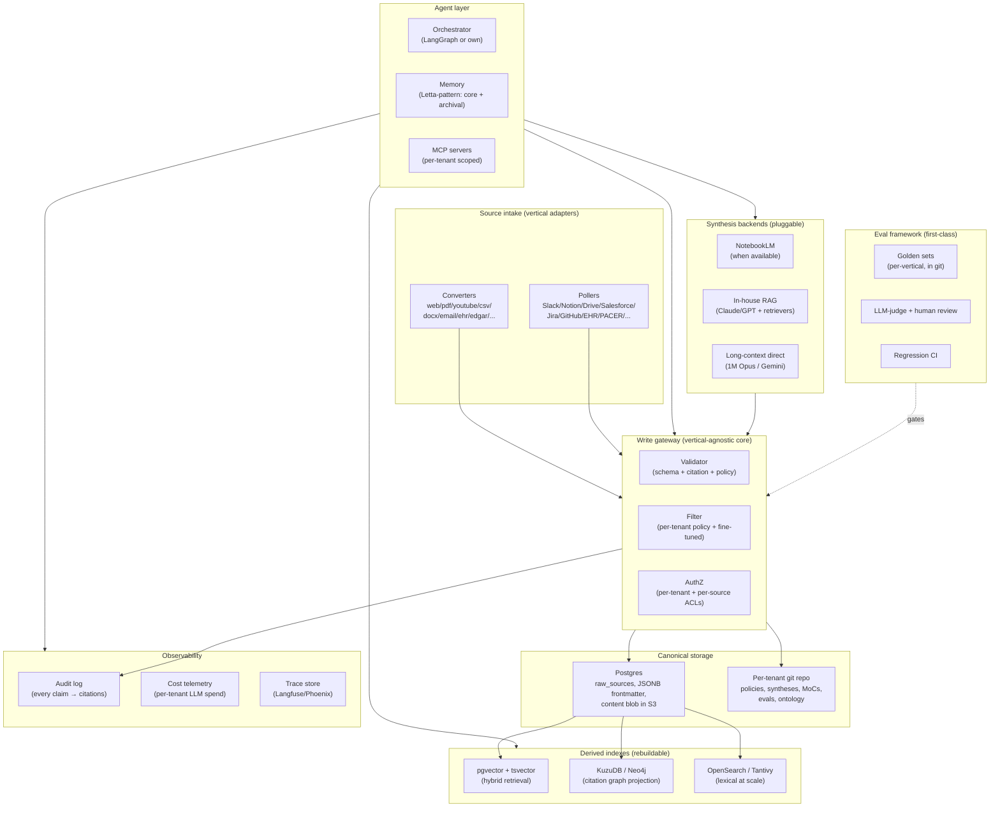

# Knowledge System — Comprehensive Review & Roadmap

**Date:** 2026-05-23
**Audience:** Andrew + future technical hires/collaborators
**Status:** Initial review. Findings derived from 8 parallel agent audits (architecture, ontology, toolchain, data quality, agents, token efficiency, integrations, documentation). Decisions still required from Andrew where flagged.
**Snapshot horizon:** wiki state numbers below were captured 2026-05-23. They will drift; treat anything outside this doc's footer as descriptive, not prescriptive.

---

## 0. How to read this document

This doc is two tracks bolted together:

- **Track A — Audit & Incremental.** Findings within the current architectural envelope (LLM Wiki pattern, filesystem-as-DB, gateway-mediated writes, NotebookLM as synthesis backend, citation grounding). Eight lenses, ~110 numbered findings (`ARCH-n`, `ONT-n`, `TOOL-n`, `QUAL-n`, `AGT-n`, `TOK-n`, `INT-n`, `DOC-n`). Sequenced as a **30/90/180-day roadmap**.
- **Track B — Greenfield Reference Architecture.** Vertical-agnostic substrate for a future company whose vertical is TBD. Optionality-emphasized. Sequenced as **Phase 0 (extract reusable core) / Phase 1 (substrate) / Phase 2 (productization)**.

### Suggested reading order if you have 60 minutes

1. § 1 (executive summary) — 5 min
2. § 2 (glossary) — 5 min, keep open as you read
3. § 3 (cross-cutting themes) — 10 min, this is where the leverage lives
4. § 12 (phased roadmap) — 10 min, scan
5. Pick **one** Track A lens (§ 4–11) that matches the next thing you'd touch — 15 min
6. § 13 (Track B) — 10 min if you're thinking about the company; skip otherwise
7. § 14 (open questions) — 5 min, this is where you decide what's next

### Suggested reading order if you have 4 hours and have never seen the repo

1. `README.md` (10 min)
2. `WIKI.md` § 3, 4, 5, 11 (40 min) — schema + citations + validator
3. `TUTORIAL.md` § 1–5, then actually `wiki ingest` a PDF (30 min)
4. This doc § 1–3 (20 min)
5. `src/gateway/core.py`, `validator.py`, `cli.py` (90 min) — the choke-point
6. This doc, full pass (60 min)

---

## 1. Executive summary

**Where the system stands.** The system has shipped through M45.1 (~3000 wiki pages, ~1200 raw sources, 14 source converters, 1 poller, 793 tests). The choke-point gateway, citation-grounded validator, draft lifecycle, domain proposals→blessed→promoted flow, fine-tune feedback loop, and NotebookLM-backed synthesis are all working. Architecturally it is more disciplined than every commercial PKM the audit benchmarked against (Reflect, Mem, Tana, Capacities, Logseq, Roam). The bones are good.

**The four highest-leverage problems.** All four are operational, not architectural — the architecture is making them visible, not causing them:

1. **Draft-debt is an unbroken one-way valve.** ~540 wiki pages are draft. M45.1 (2026-05-13) made `--draft` the default for research-driven authoring, which was the correct call given fragile citation-grounding under NotebookLM phrasing changes. But no consumer of the draft tail exists — `wiki finalize` is one page at a time, `wiki cite` has a body-line/file-line bug, and there is no batch finalizer or auto-abandon. The draft tier will eat the wiki if left.
2. **The agent surface is narrower than the human surface.** MCP exposes ~13 of ~28 implemented CLI ops. The intent ("Claude Code is the primary interface") is inverted by the missing ops: `wiki research`, `wiki cite`, `wiki discover-domains`, `wiki promote-domain`, `wiki lint`, `wiki finetune`, `wiki bootstrap-domain`, `wiki batch-ingest` — none on MCP. Every agent recommendation in § 8 is bottlenecked on this.
3. **No eval framework.** There is no way to know whether milestone changes (filter prompt edits, policy distillations, M45 `synthesizes:`, M45.1 `--draft` default, future schema migrations) regress quality. Every quality recommendation in § 7 needs a golden-set reference to measure against.
4. **Single surface, single machine.** Capture only works from a terminal inside `~/code/knowledge/`. There is no mobile path, no browser extension, no scheduled-job runner, no remote-access shim. The user reads on phone and currently has zero capture there. Tailscale + bound `wiki serve` + an iOS Shortcut is the minimum-viable fix and is well under a week of work.

**The keystone unlocks (do these first).** Five small-to-medium items unblock most of the rest of the roadmap:

- **K1.** Gateway edit-path: ship `wiki cite-add` (atomic claim-level citation insertion, fixes the body-line bug) and `wiki edit` (constrained section-replace). [`ARCH-5`, `QUAL-11`, `AGT-10`]
- **K2.** MCP-CLI parity: expose every implemented CLI op as an MCP tool. [`ARCH-7`, `TOOL-1`, `AGT-11`]
- **K3.** Cloud shim: Tailscale + `wiki serve --bind 0.0.0.0` + bearer-token `/api/ingest`. [`TOOL-2`, `TOOL-3`]
- **K4.** Scheduler substrate: `.knowledge/schedule.yaml` + a launchd timer, mirroring the watcher pattern. [`TOOL-7`]
- **K5.** Token telemetry: capture `input/output/cache_read` per LLM call to `log.md`. [`TOK-2`]

K1–K5 are all single-week scopes. They make the next ~40 findings actually shippable. **If you do nothing else from this doc, do K1–K5.**

**Single biggest non-engineering decision.** Are you willing to run research subprocesses against an Anthropic API key (separate from your Max IDE plan) to unlock prompt caching? Today Max OAuth structurally blocks the 90%-read-discount cache. Filter and plan-authorship are the cache-shaped workloads. This is a billing choice, not a technical one. [`TOK-1`]

**Track B (greenfield) headline.** The defensible product for a future company is **not** the synthesis. It is the citation graph + the eval harness + the permission-aware substrate. Substrate recommendation: **hybrid — markdown + git for the thinking tier, Postgres + S3 + pgvector + tsvector for the operational tier**. RDF/OWL rejected outright. Graph DBs (Neo4j/Kuzu) are derived indexes only. NotebookLM is demoted to one of N pluggable synthesis backends. The personal system's choke-point gateway, converter ABC, policy.yaml, filter+fine-tune loop, draft lifecycle, and domain proposal flow all generalize cleanly. The filesystem-as-DB substrate and single-user lock model do not. Phase 0 (extract reusable core from the existing repo) is safe and useful regardless of which vertical wedge is picked.

---

## 2. Glossary

| Term | Meaning |
|---|---|
| **Gateway** | The Python service in `src/gateway/` that mediates *all* writes to `wiki/` and `raw/`. CLI, MCP, and web app are surfaces over the same gateway. |
| **Choke-point / Discipline Gate** | The invariant that every write passes through the gateway so validator, citation grounding, log, index, and lock discipline are applied. Hard rule #1 of the system. |
| **Citation grounding** | Every claim in a wiki page is followed by `[[sources/<id>]]`. Validator rejects pages without provenance; draft mode downgrades the rule to a warning. |
| **Draft mode** | A page with `draft: true` in frontmatter. Citation grounding is a warning, not an error. M45.1 made this the default for research-driven authoring. |
| **`synthesizes:`** | Frontmatter list on synthesis pages enumerating the corpus that produced the synthesis. PROV-O-aligned "wasDerivedFrom" semantics. |
| **MoC** | Map of Content. One page per domain that indexes entities, concepts, syntheses, and open threads. Pattern from the Obsidian community / Zettelkasten lineage. |
| **Domain proposal lifecycle** | `discover-domains` → `wiki/proposals/<slug>.md` → `promote-domain` → blessed domain with policy.yaml + example bank. `demote-domain` reverses; `reject-proposal` discards. |
| **Filter** | Per-source classification (`include` / `review` / `exclude`) using a per-domain `policy.yaml` + example bank. LLM-driven; Haiku-tier in current build. |
| **Filter band** | Sources scored between `threshold_review` and `threshold_include` — the human-review queue. |
| **Example bank** | Per-domain corpus of `(source, decision, rationale)` examples used as few-shot in the filter and (eventually) as fine-tune data when the count crosses ~500. |
| **Policy.yaml** | Per-domain editorial policy: include/exclude criteria, thresholds, key entities, MoC pointer. Lives at `.knowledge/policies/<domain>/policy.yaml`. |
| **NotebookLM corpus / notebook** | A persistent Google NotebookLM notebook per domain, populated by `wiki nlm-sync`, used by `wiki query` and `wiki nlm-*` artifact ops. Registry at `nlm/notebooks.yaml`. |
| **Source map** | Translation from NotebookLM's per-query citation numbering back to `raw/<id>` identifiers. Persisted at `nlm/source_maps/<session>.json`. |
| **Query plan** | YAML describing a multi-adapter research run (NotebookLM + web + arXiv + etc.). Persisted at `nlm/query_plans/<date>-<slug>.yaml`. |
| **Watcher** | launchd-managed daemon that picks up files dropped into `raw/inbox/` and runs them through the ingest pipeline. |
| **Poller** | Subclass of `Poller` that runs on a schedule (or via `wiki poll <name>`) to pull from API-only sources. Apple Notes shipped; Gmail/Notion/Slack queued. |
| **Aggregate framing opener** | A documented allowlist of NotebookLM phrasings that wrap claims without per-claim citations (e.g., "Across these sources..."). Citation grounding tolerates them; M46 followup flagged the allowlist as a fragile NLM-compat shim. |
| **CiTO** | Citation Typology Ontology (Shotton 2010). 41 typed citation relations (`supports`, `disputes`, `extends`, `qualifies`, etc.). Not yet adopted; recommended subset in `ONT-2`. |
| **PROV-O** | W3C Provenance Ontology. `wasDerivedFrom`, `wasGeneratedBy`, `wasAttributedTo`. Vocabulary inspiration for `synthesizes:`. |
| **Surface-anchor leakage** | When porting code from specific to general purpose, surface conventions (prompts, labels, examples, slugs) silently inherit the original domain's assumptions even when structural decisions are rethought. Andrew's memory entry. Material to Phase 0 of Track B. |
| **Cold-start memory** | Read this glossary + § 0 + § 1 before reading any lens-specific section. Most acronyms (MoC, ADR, MCP, FRBR, RAG) are defined here once. |

---

## 3. State of the system (snapshot 2026-05-23)

| Surface | Count | Notes |
|---|---|---|
| Wiki entities | 769 | 24 free-text `entity_kind` values; controlled-vocab needed (`ONT-4`) |
| Wiki concepts | 1117 | Overloaded — includes claims/findings/methods. Split recommended (`ONT-1`) |
| Wiki sources | 979 | Most still placeholder-summary (`ONT-10`) |
| Wiki syntheses | 94 | 38/94 carry `synthesizes:` enumeration |
| MoCs | 22 | For 11 blessed domains — some sub-domain scoped |
| Proposals | 7 | Open / pending review |
| Artifacts | 3 | NotebookLM-generated; non-canonical |
| Raw sources | ~1200 | 386 PDF, 357 web, 267 YouTube, 78 PubMed, 70 arXiv |
| Drafts outstanding | ~540 | 274 concepts, 239 entities, 29 syntheses |
| Gateway modules | 30+ | `src/gateway/` |
| Gateway ops | 22 | `src/gateway/ops/` |
| CLI commands | 30 | ~28 implemented; 2 stubs (`wiki search`, `wiki index`) |
| MCP tools | 13 | ~10 implemented CLI ops have no MCP equivalent |
| Converters | 14 | web, youtube, arxiv, pubmed, pdf, voice, audiobook, note, csv, docx, xlsx, pptx, image, base |
| Pollers | 1 shipped | Apple Notes; Gmail/Notion/Slack/RSS/podcast queued |
| Tests passing | 793 | Through M45.1 |
| Web UI routes | 12 | `/research`, `/review`, `/domains/artifacts`, dashboard |
| log.md | ~17,300 lines | Append-only event log |
| Lint scopes | 13+ | Citation density, slug-similarity, orphans, stale-drafts, contradictions, citation-chains, etc. |

**Per-domain fine-tune readiness (toward 500-decision threshold):**

- `glp1-reward-modulation`: 268 / 500 (54%)
- `edge-ai-agentic`: 151 / 500 (30%)
- `ai-temporal-video`: 82 / 500 (16%)

Several newer domains (`condo`, `condo-capital-infra`, `condo-software`, `risksystems`, `ai-native-business`) are still in early-decision-count territory.

This snapshot will drift. Re-derive via `wiki status` and `wiki lint` for any decisions taken after 2026-06.

---

## 4. Cross-cutting themes

Findings cluster around 15 cross-cutting themes. Each theme names which agent lenses surfaced it; cross-references go to the per-lens finding tables in §§ 4–11.

### CC1. The edit-path vacuum

The single most-referenced gap. `wiki cite` exists for citation insertion but has a body-line vs file-line numbering bug (M46 followup #6) and only handles citations. Nothing else exists for amending an existing wiki page through the gateway. Hard rule #1 (no direct writes to `wiki/`) holds socially, not structurally. Most quality, agent, and ontology findings end up bottlenecked here — a contradiction can't be resolved, a draft can't be partially-edited, a stale claim can't be revised, all without an edit path.
**Surfaced by:** `ARCH-5`, `ARCH-14`, `ONT-3`, `QUAL-3`, `QUAL-11`, `AGT-10`. **Resolution:** ship `wiki cite-add` + `wiki edit --section`, both validator-coverred.

### CC2. Draft-debt is one-way

542+ drafts; M45.1 made `--draft` the default for research authoring; no batch finalizer exists; auto-abandon policy isn't implemented. Synthesis drafts: 29 outstanding, 0 ever finalized. The wiki is on a path where the draft tier swallows the canonical tier. CitGrounding strictness becomes advisory through accumulation.
**Surfaced by:** `ARCH-11`, `QUAL-2`, `AGT-2`, `TOOL-8`. **Resolution:** `wiki finalize-batch`, per-domain draft cap surfaced in `wiki status`, 30-day auto-abandon, `wiki cite --suggest` for the high-friction cases.

### CC3. MCP narrower than CLI

The agent surface should be at least as wide as the human surface. It isn't — ~10 implemented CLI ops have no MCP equivalent (`research`, `cite`, `discover_domains`, `promote_domain`, `bootstrap_domain`, `lint`, `finetune`, `batch_ingest`, `nlm_revise` audio variant, `poll`). Every cross-project agent recommendation flows through this gap. The 30-day fix is mechanical.
**Surfaced by:** `ARCH-7`, `TOOL-1`, `AGT-11`. **Resolution:** parity sweep + CI grep enforcing it.

### CC4. No eval framework

There is no measurement of "is the system getting better." Every milestone is shipped on intuition. Filter-calibration uses `n=5` samples per domain (statistically meaningless). The fine-tune trigger (500 decisions) is invisible to the user. Every other quality finding (link rot, retraction, semantic citation-claim coherence, last-verified, drift) needs an eval substrate.
**Surfaced by:** `QUAL-10`, `QUAL-12`, `ARCH—implicit`, `ONT—implicit`, `AGT—implicit`. **Resolution:** per-domain golden sets at `.knowledge/eval/<domain>/goldens.yaml`; `wiki eval` op; LLM-as-judge; per-version tracking. This is the keystone for half of Track A and explicitly part of Track B.

### CC5. Contradictions are a one-way drain

`.knowledge/contradictions/log.jsonl` exists with ~34 records. `lint/contradictions.py` writes them. Nothing reads them. No status (`open|investigating|resolved|wontfix`), no surfacing in the UI, no resolution workflow, no first-class page type. The Florida-SIRS / HB-913 cluster shows the workflow is needed and the data is already there.
**Surfaced by:** `ONT-3`, `QUAL-3`, `AGT-4`. **Resolution:** promote to either first-class page type or first-class frontmatter field; add `contradiction` ops; weekly sweeper agent.

### CC6. Ontology drift accumulated

24 free-text `entity_kind` values (8 singletons; collisions like `paper`/`publication`/`journal-issue`). 190-char "concept" slugs encoding empirical findings. 0/769 entities have the documented `last_updated`. 149 concepts carry undocumented `tags:`. 38/94 syntheses carry the `synthesizes:` field. The schema in WIKI.md and the schema enforced by the validator have diverged.
**Surfaced by:** `ONT-1`, `ONT-4`, `ONT-6`, `ONT-8`, `ONT-11`, `ONT-12`. **Resolution:** controlled vocab for `entity_kind`; new `claim`/`finding` page type to absorb the concept overflow; slug cap at 80 chars; validator enforces documented required fields with backfill migration.

### CC7. NotebookLM is a single point of failure

`wiki query` requires a persistent NLM corpus; the pre-rebuild bag-of-words fallback was removed. All synthesis runs through `NlmCLIClient`. NLM is a Google Labs product with no SLA, no enterprise terms, no second-source. The synthesis citation allowlist (`citations._STRUCTURAL_FRAME_LABELS`) is a frozen NLM compatibility shim. For Track A this is a moderate risk (mitigation: ship a second `NlmClient` backend). For Track B (greenfield) this is non-negotiable — NLM must be one of N pluggable backends, never the default.
**Surfaced by:** `ARCH-12`, `TOK-9`, `Track B § 13.3`. **Resolution:** abstract `NlmClient` second impl (Gemini-direct or Claude-direct); record `synthesis_backend` in artifact frontmatter.

### CC8. Token efficiency is structurally capped by Max-plan OAuth

M44 stripped harness tax (5–10 KB/call) and routed filter to Haiku; M44.1 parallelized. Net: research runs 47 min → 6 min. But Anthropic prompt caching (90% read discount, 5-min TTL) is structurally unreachable on Max OAuth — `claude_cli_env()` strips `ANTHROPIC_API_KEY`. Filter does 50–200 identical-prefix calls/run, the cache-shaped workload. The cost is real; the engineering is small; the decision is billing.
**Surfaced by:** `TOK-1`, `TOK-2`, `TOK-11`. **Resolution:** decide on hybrid Max-for-IDE / API-for-subprocess; ship cache_control once decided.

### CC9. The plan-authorship context is unbounded

`_gather_existing_pages` in `ops/ingest.py:541` loads up to 30 full wiki pages per `wiki ingest --with-plan` call. 30 × 1–10 KB = 30–300 KB user-prompt context against Opus. This grows with wiki size, not source size — the breakage point well before the BM25/vector threshold mentioned in CLAUDE.md. Two-stage select: ship snippets first, full bodies only on agent request.
**Surfaced by:** `TOK-4`. **Resolution:** Phase-1 keyword index (file titles + first 200 chars) at `.index/wiki-titles.json`; rebuild on write. BM25 deferred until 6–8k pages.

### CC10. Pollers are underbuilt; high-signal channels stay manual

Apple Notes shipped; nothing else. The user's actual reading firehose (Gmail newsletters, podcasts, RSS, Notion shared docs, Twitter bookmarks, sibling-repo READMEs/CLAUDE.md) is invisible to the wiki today. The `substack-digest` skill works outside the gateway, violating hard rule #1 in spirit. One generic poller pattern (cursor + idempotency + write-through-validator) absorbs all of these.
**Surfaced by:** `TOOL-5`, `TOOL-6`, `INT-1`, `INT-2`, `INT-3`, `INT-5`, `INT-6`, `INT-8`, `INT-9`, `AGT-1`. **Resolution:** Gmail poller first (highest volume + replaces substack-digest); then podcast (transcript-first reuses voice infra); then RSS; then repo-metadata; defer Slack/Notion to need.

### CC11. Cloud/mobile capture is missing

Capture only works from `~/code/knowledge/` with a venv active. No mobile path. No browser extension. No remote endpoint. The user reads on phone constantly and captures zero of it. Tailscale + `wiki serve --bind 0.0.0.0` + `/api/ingest` + an iOS Shortcut is a 1-week scope and unblocks half the integration findings.
**Surfaced by:** `TOOL-2`, `TOOL-3`, `TOOL-4`, `TOOL-9`, `AGT-7`, `INT—implicit throughout`. **Resolution:** ship the shim; keep filesystem-as-DB intact (laptop stays canonical; Tailscale is a transit layer).

### CC12. Scheduled-jobs substrate doesn't exist

TUTORIAL §10 names daily/weekly/monthly rhythms; the user runs none of them on a schedule. The `schedule` and `loop` skills are available. Watcher is already launchd-managed. A `.knowledge/schedule.yaml` + a second launchd timer is the same shape as the watcher. Until this exists, every agent in § 8 is "run by hand when I remember to." After it exists, agents become real automation.
**Surfaced by:** `TOOL-7`, `AGT-9`. **Resolution:** ship the substrate; default schedule includes nightly lint, daily polls, weekly digest, monthly fine-tune-check.

### CC13. Temporal quality controls are absent

Link rot for 357 web sources (Wikipedia studies put rot at ~11%/year). PubMed retraction monitoring for 78 sources. arXiv version-bump monitoring for 70 sources. No `last_verified_at` on any wiki page. Sources are treated as eternally true. Wayback snapshots not captured at ingest. Re-ingest policy for revised sources undefined.
**Surfaced by:** `QUAL-1`, `QUAL-7`, `QUAL-13`, `QUAL-14`. **Resolution:** link-rot poller, retraction-feed poller, Wayback at ingest, `superseded_by`/`supersedes` for revisions, `last_verified_at` for time-sensitive pages.

### CC14. Onboardability gap for hires

The system is documented for one user + an always-on Claude Code agent. A senior engineer cold-starting needs a CONTRIBUTING.md, ARCHITECTURE.md, per-package READMEs, ADRs (the user's private memory should partially become public ADRs), GLOSSARY.md, MCP API ref, runbook. Roughly 15 hours of focused doc work. None of it is hard — it's currently in private memory or scattered across BUILD.md.
**Surfaced by:** `DOC-1` through `DOC-12`. **Resolution:** the F1–F4 + F7 cluster from § 11 (~10–12 hours).

### CC15. Surface-anchor leakage is loaded for Phase 0 of Track B

The user's memory entry `feedback_general_purpose_inherits_surface_anchors.md` flags that when porting code specific→general, surface conventions (variable names, prompt templates, example content, section headers) silently inherit the original domain's assumptions. The personal system's prompts, example pages, validator messages, and policy templates are tuned for `glp1-reward-modulation`, condo, risksystems. Phase 0 of Track B *must* audit these or the commercial substrate ships pre-contaminated.
**Surfaced by:** `Track B § 13.7`. **Resolution:** explicit Phase-0 audit pass on every prompt, example, label, regex, allowlist, and section header.

---

## 5. Track A.1 — Architectural audit (Gateway core)

The gateway is well-shaped as a write-discipline layer. The choke-point is enforced socially (CLAUDE.md hard rule #1 + reviewer eyes) rather than structurally. Lock granularity is uneven and undocumented. Source immutability covers body but not sidecar binaries, and frontmatter mutation policy is not validator-enforced. MCP lags CLI by ~10 ops.

### ARCH-1. `log.md` and `index.md` writes are racy and unlocked

- **Impact:** 4 · **Effort:** S · **Deps:** none
- `log.append` uses naked append; `index.update_for` does read→check→mutate→write, both without `flock`. Concurrent CLI + watcher + research is the real triple.
- **Risk if skipped:** silent log truncation; `index.md` data loss.
- **Acceptance:** `file_lock("log")` and `file_lock("index")` around the respective writes; tests asserting concurrent writers produce distinct entries.

### ARCH-2. Source-frontmatter mutation policy is not validator-enforced

- **Impact:** 4 · **Effort:** M · **Deps:** none
- WIKI § 11.5 names an allowlist (`filter`, `nlm_corpus_ids`, `wiki_pages`, `domains`); validator doesn't check it.
- **Risk:** silent drift in source metadata.
- **Acceptance:** `validate_source_frontmatter_diff(old, new)` rejects out-of-allowlist key changes; tests prove a `title:` mutation is rejected.

### ARCH-3. Pollers and watcher bypass `write_atomic` + validator

- **Impact:** 3 · **Effort:** S · **Deps:** `ARCH-2`
- `pollers/base.py:80-85` writes with `target.write_text` — no atomic temp+rename, no validator pass, no log entry.
- **Acceptance:** `Poller.write_raw` routes through `write_atomic` + `validate_source_frontmatter`; rejected payloads go to `.knowledge/pollers/<name>/_rejected/`; success appends a `poll` log entry.

### ARCH-4. Research orchestrator writes raw files outside any lock; skips filter writeback

- **Impact:** 3 · **Effort:** S · **Deps:** none
- `research/orchestrator.py:_materialize` does `write_atomic` with no per-source lock and no `filter:` block, leaving research-materialized sources with empty filter frontmatter (M46 followup #5).
- **Acceptance:** acquire `file_lock(f"ingest-{source_id}")`; write computed filter score; test parallel research vs ingest doesn't corrupt.

### ARCH-5. Promote `wiki cite` from open question to first-class; add `wiki edit` [KEYSTONE K1]

- **Impact:** 4 · **Effort:** M · **Deps:** none
- `wiki cite` exists but operates on file-line while validator reports body-relative line (M46 followup #6). No `wiki edit` for non-citation amendments. 540+ drafts queue depends on this.
- **Acceptance:** unify line numbering; `wiki cite-add <page> --claim "<exact-line>" --source <id>` is idempotent; `wiki edit <page> --section <name>` constrained surface, re-validates, appends log entry; both as MCP tools.

### ARCH-6. Idempotency contract has holes (`register_session`, `promote_domain` re-promote, `bootstrap_domain` with same description)

- **Impact:** 3 · **Effort:** S · **Deps:** none
- Memory entry `gateway_idempotent_convergent.md`: rerun should converge, never misleading no-op. `register_session` crashes outright on `status=promoted` re-execute.
- **Acceptance:** every op file documents `Idempotency:` field; `register_session` accepts `force=True` and handles re-execute; lint scope `idempotency` enumerates state-file vs on-disk drift.

### ARCH-7. MCP surface lags CLI by ~10 ops [KEYSTONE K2]

- **Impact:** 3 · **Effort:** M · **Deps:** none
- Missing: `wiki_research`, `wiki_cite`, `wiki_bootstrap_domain`, `wiki_discover_domains`, `wiki_promote_domain`, `wiki_demote_domain`, `wiki_reject_proposal`, `wiki_lint`, `wiki_finetune`, `wiki_batch_ingest`, `wiki_poll`. Unblocks every agent recommendation in § 8.
- **Acceptance:** every `def <op>` in `ops/` has an `mcp_server.py` registration or an explicit `CLI_ONLY` allow-list entry; CI grep enforces.

### ARCH-8. Lock-name explosion + no lock-file lifecycle

- **Impact:** 2 · **Effort:** S · **Deps:** none
- `.knowledge/locks/` has 400+ persistent lock files; no GC; no enumerated registry.
- **Acceptance:** `locking.LOCK_NAMES` registry; `log`/`index` locks added (per `ARCH-1`); GC 30-day-stale locks in `wiki status`.

### ARCH-9. Source-immutability doesn't cover sidecar binaries

- **Impact:** 2 · **Effort:** S · **Deps:** none
- Body is immutable; PDF/audio sidecar can be silently replaced.
- **Acceptance:** `sidecar_hash` frontmatter field for types with sidecars; validator rejects diff; backfill helper.

### ARCH-10. Citation grounding allowlist is a frozen NotebookLM compatibility shim

- **Impact:** 3 · **Effort:** M · **Deps:** none
- `_STRUCTURAL_FRAME_LABELS` + `_AGGREGATE_FRAMING_OPENERS_RE` are hand-patched English phrases tuned to NLM's emission shape; future NLM updates re-trigger the whack-a-mole that M45.1 was meant to eliminate.
- **Acceptance:** move lists to versioned `citations_allowlist.yaml`; document as explicit NLM compat shim in WIKI § 5.2; test fixture pinning the existing set so new prose triggers an explicit decision.

### ARCH-11. Draft backlog (~540 pages) has no triage workflow [KEYSTONE — see CC2]

- **Impact:** 4 · **Effort:** M · **Deps:** `ARCH-5`
- `stale_drafts` lint flags them but no batch finalizer, no per-domain cap, no auto-abandon.
- **Acceptance:** per-domain draft cap surfaced in `wiki status`; `wiki finalize --batch <glob>` auto-finalizes pages that pass strict validator; 30-day auto-abandon for zero-citation drafts; `wiki cite --suggest` for friction cases.

### ARCH-12. NotebookLM is a single point of failure

- **Impact:** 3 · **Effort:** L · **Deps:** none
- `wiki query` requires persistent NLM corpus; pre-rebuild bag-of-words fallback removed; all synthesis runs through `NlmCLIClient`.
- **Acceptance:** second `NlmClient` backend (Gemini-direct or Claude-with-loaded-corpus); `--backend` flag; `synthesis_backend:` recorded in artifact frontmatter.

### ARCH-13. Query-plan lifecycle is undefined

- **Impact:** 2 · **Effort:** S · **Deps:** none
- 50+ plans accumulated; no `status` field; no archival; no `--resume` (only `--execute`).
- **Acceptance:** `status: planned|executed|abandoned`; `--resume` re-runs only materialize+synthesis from checkpoint; archive executed plans > N days.

### ARCH-14. Hard rule #1 is structurally unenforced [see CC1]

- **Impact:** 3 · **Effort:** S · **Deps:** `ARCH-5`
- Convention test (`grep -l "write_text" src/gateway/` filtered to non-allowlisted paths) would lock in the boundary as CI invariant.
- **Acceptance:** CI grep; resolution recorded in WIKI § 9 (op or git-review-mandatory or hybrid); memory entry `gateway_edit_path_open_question.md` updated.

### ARCH-15. No `schema_version` field on raw/wiki frontmatter

- **Impact:** 2 · **Effort:** S · **Deps:** none
- WIKI § 14.5 reserves it; never set; future schema changes carry undetectable backwards-compat tail.
- **Acceptance:** `schema_version: 1` stamped by gateway; migration framework writes the version on touched pages; validator warns on missing.

---

## 6. Track A.2 — Ontology + schema review

The page-type taxonomy (entity / concept / source / synthesis / MoC / proposal / artifact) is sound. The strain points: concept is overloaded (atomic findings + abstract ideas + study reports + methods, all in one type); citation grammar is binary (no CiTO-style typing); frontmatter is documented but not enforced; entity_kind has 24 free-text values where ~12 controlled values exist in reality.

### ONT-1. Add `claim` / `finding` page type; reclassify ~1000 mistyped concepts

- **Impact:** 5 · **Effort:** L · **Deps:** none (migration runs separately)
- 1117 concepts include sentence-encoded study-finding slugs at 190 chars. Per Zettelkasten atomicity, a concept is a recurring abstract idea (`food-noise`, `reward-blunting`); a single empirical result is a literature note/finding.
- **Acceptance:** new `claim` type in `PAGE_SCHEMAS`; literature-note section shape (Claim/Evidence/Source/Confidence/Related); migration script proposes reclassifications via the proposals lifecycle; validator hard-caps slugs at 80 chars (configurable).

### ONT-2. Add typed citation relations (CiTO subset)

- **Impact:** 5 · **Effort:** M · **Deps:** none
- 8-verb subset (`supports`, `disputes`, `extends`, `qualifies`, `confirms`, `reviews`, `usesMethodIn`, `citesAsAuthority`) covers operating need. Syntax: `[[sources/<id>|supports]]` (wikilink alias) or frontmatter `citation_relations:` block. Contradictions log is already encoding this informally.
- **Acceptance:** `_CITO_VERBS` allowlist in `citations.py`; lint warns on unknown verbs; WIKI § 5.6 documents the extension.

### ONT-3. Promote contradictions to first-class [see CC5]

- **Impact:** 4 · **Effort:** M · **Deps:** `ONT-2`
- JSONL is invisible to the graph. Promote to either a `contradiction` page type or a `contradicts:` frontmatter field that round-trips through the validator.
- **Acceptance:** page type with `parties: [a, b]`, `severity:`, `sources:`, `resolution:`; JSONL migrated; `wiki lint --scope contradictions`.

### ONT-4. Controlled vocabulary for `entity_kind`

- **Impact:** 4 · **Effort:** S · **Deps:** none
- 24 free-text values; 8 with count=1; overlapping (`paper`/`publication`/`journal-issue`/`periodical`); naming drift (`policy_document` vs `policy-document`).
- **Acceptance:** ~12-kind enum (person, organization, paper, drug, dataset, product, software, statute/regulation, standard, place, event, other); validator rejects non-enum; migration script consolidates.

### ONT-5. Resolve entity-vs-source overlap for papers (FRBR-style)

- **Impact:** 4 · **Effort:** M · **Deps:** `ONT-4`
- 46 `entity_kind: paper` entities; many also have `sources/pdf-<id>.md`. Citation chains become inconsistent.
- **Acceptance:** `canonical_source:` field on paper entities; validator requires it; lint surfaces "paper entity without canonical source".

### ONT-6. Enforce documented frontmatter (`last_updated`, `created_at`, `sources_count`)

- **Impact:** 3 · **Effort:** S · **Deps:** none
- 0/769 entities have `last_updated`; 17/769 have `created_at`. Documented as required; never validated.
- **Acceptance:** validator adds to required fields for entity/concept/synthesis; write path stamps; one-time backfill.

### ONT-7. Per-claim confidence (lightweight 3-tier GRADE)

- **Impact:** 4 · **Effort:** M · **Deps:** `ONT-2`
- 3-tier (`established | tentative | speculative`) avoids full GRADE complexity. Syntax: `[[sources/<id>|extends:tentative]]` or per-section annotation.
- **Acceptance:** optional `confidence:` per claim bullet; lint reports per-domain distribution; propagation rule: synthesis citing tentative claim inherits ≤ tentative.

### ONT-8. Cap slug length at 80 chars; enforce semantic naming

- **Impact:** 3 · **Effort:** S · **Deps:** `ONT-1`
- 190-char "slugs" are sentence-encoded titles. Levenshtein-2 check meaningless at that length.
- **Acceptance:** validator hard-rejects new slugs > 80 chars with `--force-long-slug` override; legacy slugs grandfathered with lint flag.

### ONT-9. Domain hierarchy (SKOS broader/narrower) for MoC scaling

- **Impact:** 3 · **Effort:** M · **Deps:** `ONT-4`-ish
- 22 MoCs for 11 blessed domains; some sub-domain scoped. `mocs/condo*` are co-equal but one is broader.
- **Acceptance:** `parent_domain:` and `child_domains:` on MoC frontmatter; policy.yaml mirrors; validator: DAG (no cycles); index renders nested.

### ONT-10. Source pages: kill the stub state or kill the page type

- **Impact:** 3 · **Effort:** M · **Deps:** none
- 980 source pages, most with `_(summary not yet generated — agent-driven authorship lands in M6)_` placeholder. Either bulk-generate or change to manifest-only.
- **Acceptance:** decision recorded; if manifest-only, drop required-sections; if filled, batch generation via NLM corpus.

### ONT-11. Make `synthesizes:` mandatory (Cochrane "Characteristics of included studies")

- **Impact:** 3 · **Effort:** S · **Deps:** none
- 38/94 syntheses have it; M45 invested in the mechanism. Cochrane reviews require the included-studies block — make it lint warning, escalate to error after backfill.
- **Acceptance:** backfill helper proposes `synthesizes:` from body citations; lint warning → error; tests.

### ONT-12. Codify or remove `tags:`

- **Impact:** 2 · **Effort:** S · **Deps:** `ONT-1`
- 149 concepts carry undocumented `tags:` (shadow taxonomy). Either define semantics or strip.
- **Acceptance:** decision; WIKI documents; validator enforces.

### ONT-13. `last_verified_at` for time-sensitive entity kinds

- **Impact:** 3 · **Effort:** M · **Deps:** `ONT-6`, `QUAL-12` (need eval to know what verified means)
- 33 statutes, 14 regulations, 5 standards — all decay. Cochrane reviews require re-search dates.
- **Acceptance:** optional `last_verified_at`; required for `entity_kind ∈ {statute, regulation, standard, price}`; lint surfaces stale > 365d.

### ONT-14. Optional `question` page type for open research threads

- **Impact:** 2 · **Effort:** M · **Deps:** none
- MoC and synthesis templates have "Open questions" sections; nothing aggregates them. Roam/Tana pattern.
- **Acceptance:** `wiki/questions/<slug>.md`; `status: open|partial|answered`; `synthesis:` link when answered.

### ONT-15. PROV-O-align: rename `synthesizes:` → `wasDerivedFrom:` (optional)

- **Impact:** 1 · **Effort:** S · **Deps:** `ONT-11` (do together if at all)
- Cosmetic alignment with W3C PROV-O. Skip unless rebranding is cheap.

---

## 7. Track A.3 — Toolchain + surfaces

Everything assumes the user is at a terminal in `~/code/knowledge/` with a venv. Capture is fast in that posture; everything else (mobile, voice, browser, scheduled background runs, remote access) is non-existent. Recommend Tailscale + scheduler first — they unlock 60% of the other findings.

### TOOL-1. MCP-CLI parity sweep [KEYSTONE K2 — see ARCH-7]

### TOOL-2. Tailscale + bound `wiki serve` for cloud availability [KEYSTONE K3]

- **Impact:** 5 · **Effort:** S · **Deps:** none
- `wiki serve` already accepts `--bind 0.0.0.0`. Tailscale gives WireGuard-backed stable hostname; auth via identity provider; no exposed ports. Laptop stays canonical — filesystem-as-DB intact.
- **Acceptance:** `/api/ingest` and `/api/poll/<name>` with bearer-token auth in `.knowledge/auth.yaml`; one-page setup doc; new "remote inbox" lane in `wiki status`.

### TOOL-3. iOS Shortcut → `/api/ingest` share-sheet [KEYSTONE K3 cont.]

- **Impact:** 4 · **Effort:** S · **Deps:** `TOOL-2`
- 15 min of Shortcuts configuration. Three taps from Safari/Notes/Voice Memos to `raw/inbox/`.
- **Acceptance:** `scripts/wiki-share.shortcut`; published in TUTORIAL § Mobile Capture.

### TOOL-4. Browser extension OR Obsidian Web Clipper config

- **Impact:** 4 · **Effort:** S–M · **Deps:** `TOOL-2`
- 358/1167 sources are web. Obsidian Web Clipper writing to `raw/inbox/clippings/` + watcher routing rule = 80% value, 20% effort. Manifest-V3 extension = full polish.
- **Acceptance:** one-click capture lands in `raw/inbox/`; web converter handles it; domain dropdown.

### TOOL-5. Gmail newsletter poller [see CC10 + INT-1]

### TOOL-6. RSS + podcast poller pair [see INT-2, INT-3]

### TOOL-7. Scheduled-jobs substrate [KEYSTONE K4]

- **Impact:** 5 · **Effort:** M · **Deps:** none
- launchd already manages the watcher. Same pattern + a `.knowledge/schedule.yaml` of {name, cron, command}.
- **Acceptance:** `wiki schedule add/list/run`; missed runs queue rather than drop; default schedule (nightly lint, daily polls, weekly digest, monthly fine-tune-check).

### TOOL-8. Daily-review surface

- **Impact:** 3 · **Effort:** M · **Deps:** `TOOL-7`
- No spaced-repetition or revisit surface. Wiki has the data (`draft: true`, `ingested_at`, `wiki_pages: []` orphans, citation density) — no consumer.
- **Acceptance:** `wiki daily` CLI; web `/today` route; daily-digest email-to-self when `TOOL-7` lands.

### TOOL-9. Voice → wiki pipeline (voicemode integration)

- **Impact:** 3 · **Effort:** M · **Deps:** `TOOL-2` for mobile
- voicemode MCP globally available; voice converter handles `.m4a`. Missing: `wiki capture-voice` op that records + transcribes + writes + classifies.
- **Acceptance:** desktop op + iOS Shortcut path; auto-classifier suggests domain with confidence.

### TOOL-10. Shell completion + `wiki --help` examples

- **Impact:** 2 · **Effort:** S · **Deps:** none
- 30 subcommands, no completion. `argcomplete` solves it.
- **Acceptance:** `eval "$(register-python-argcomplete wiki)"` documented; each subcommand's `--help` shows one example.

### TOOL-11. Inbox / triage view in the web app

- **Impact:** 3 · **Effort:** S · **Deps:** none
- `raw/inbox/` and `_failed/` are filesystem-only. Web view with retry button + per-file "what would this become" preview.
- **Acceptance:** `/inbox` route; counts on dashboard.

### TOOL-12. Cross-tool agent loop: "subscriptions → triage → synthesize"

- **Impact:** 4 · **Effort:** M · **Deps:** `TOOL-5`, `TOOL-7`, `AGT-1`
- Once pollers + scheduler exist, 24-hour cadence loop: poll → filter → ingest → query → file daily synthesis. The difference between passive corpus and self-newsletter.
- **Acceptance:** `wiki routine daily-domain-digest --domain <slug>`; output is draft `wiki/synthesis/daily-<domain>-<date>.md`.

### TOOL-13. Source-explorer web view

- **Impact:** 2 · **Effort:** S · **Deps:** none
- Web UI has no view of `raw/` or `wiki/sources/`. Sortable table with filter-by-domain.
- **Acceptance:** `/sources` route; substring search; preview pane.

### TOOL-14. Contradiction + drift detection on schedule

- **Impact:** 3 · **Effort:** M · **Deps:** `TOOL-7`, `ONT-3`
- Run nightly; diff against last night's report = "drift". Uniquely capable of citation-grounded corpora; no commercial PKM has this.
- **Acceptance:** `wiki lint --scope contradictions` produces stable diffable JSON; nightly diff to `.knowledge/lint/drift-<date>.json`; weekly digest summarizes new contradictions.

### TOOL-15. NotebookLM-direct round-trip for whole-corpus questions

- **Impact:** 2 · **Effort:** S · **Deps:** `ARCH-7`
- Add `wiki ask-corpus <domain> "<q>"` that hits NLM `notebook_query` directly and files response as draft synthesis. Closes a gap between `wiki query` and `wiki nlm-briefing`.

---

## 8. Track A.4 — Data quality + lifecycle

Strong structural controls. Almost all temporal controls missing. Eval framework absent — every other quality recommendation needs it.

### QUAL-1. Web-source link-rot monitor [see CC13]

- **Impact:** 4 · **Effort:** M · **Deps:** none
- Wikipedia studies put reference-link rot at ~11%/year; 358 web sources unmonitored.
- **Acceptance:** new poller writes `link_status:` to source frontmatter; new `lint/link_rot.py`; Wayback fallback URL captured at *ingest* (see `QUAL-13`).

### QUAL-2. Draft-debt triage [KEYSTONE — see CC2 + ARCH-11]

### QUAL-3. Contradiction surfacing and resolution workflow [see CC5 + ONT-3]

- **Impact:** 5 · **Effort:** M · **Deps:** `QUAL-11`, `ARCH-5`
- 34 records in JSONL; no surfacing; no resolution states.
- **Acceptance:** `status: open|investigating|resolved|wontfix`; `wiki contradiction list/resolve`; resolution mutates affected page via gateway edit path; `contested: true` on sources with ≥2 unresolved.

### QUAL-4. Validate non-source wikilink targets

- **Impact:** 4 · **Effort:** S · **Deps:** none
- Validator only resolves `[[sources/<id>]]`. `[[entities/foo]]`, `[[concepts/bar]]`, `[[mocs/baz]]` are never checked.
- **Acceptance:** validator extension: every `[[<dir>/<slug>]]` resolves; lint pass `broken-wikilinks`; `[[target|alias]]` reserved as explicit forward-reference (warning-only).

### QUAL-5. Per-domain fine-tune readiness in `wiki status`

- **Impact:** 3 · **Effort:** S · **Deps:** none
- `glp1-reward-modulation` at 54% (268/500); never surfaced.
- **Acceptance:** `wiki status` "Fine-tune readiness" line per domain; index.md § Health summary; auto-log when domain crosses 80%.

### QUAL-6. Per-page `last_verified_at` + per-domain re-review cadence [see ONT-13]

### QUAL-7. Retraction + revision monitor for academic sources [see CC13]

- **Impact:** 3 · **Effort:** M · **Deps:** none
- 64 PubMed + 52 arXiv sources. PubMed has retraction notice feed; arXiv has version revisions.
- **Acceptance:** `pollers/pubmed_retractions.py` + `pollers/arxiv_revisions.py`; `retracted: true` + `retracted_at` in source frontmatter; `lint/retracted_citations` errors any wiki page citing a retracted source.

### QUAL-8. Semantic citation-claim coherence sampling

- **Impact:** 4 · **Effort:** L · **Deps:** `QUAL-12`
- Today's grounding is structural (citation exists); not semantic (citation supports the claim). M46 #2 (orchestrator emitting `[[sources/3]]` for NLM citation numbers) is one symptom.
- **Acceptance:** new `lint/semantic_citation_coherence.py` runs LLM check on sample (1 claim/page); failures land in contradictions log (not hard rejection).

### QUAL-9. Cross-domain contamination quarantine in `promote-domain`

- **Impact:** 3 · **Effort:** S · **Deps:** none
- Legacy migration brought contamination (memory: `legacy_vault_migration_complete.md`). `promote-domain` does no contamination check.
- **Acceptance:** pre-flight cluster-coherence check; outliers flagged in proposal frontmatter; `lint/domain_purity` reports centroid drift.

### QUAL-10. Replace n=5 filter-calibration with held-out gold set

- **Impact:** 4 · **Effort:** M · **Deps:** `QUAL-12`
- n=5 is statistically meaningless. WIKI § 10.4 already calls for a held-out set.
- **Acceptance:** 30–50 calibration examples per domain at `.knowledge/policies/<d>/calibration_set.yaml`; `wiki finetune --distill` re-scores; candidate policy YAML carries `calibration_metrics` block.

### QUAL-11. Gateway edit path [KEYSTONE K1 — see ARCH-5]

### QUAL-12. Eval / regression framework — golden answer sets [KEYSTONE; CC4]

- **Impact:** 5 · **Effort:** XL · **Deps:** none (but enables QUAL-6/8/10)
- Per-domain 10–20 Q/A pairs at `.knowledge/eval/<domain>/goldens.yaml`. Each entry: question, must_cite, must_assert, must_not_assert, scoring rubric. Run `wiki eval` per milestone; LLM-as-judge; persist results; track delta.
- **Acceptance:** golden set schema; 15 Q/A pairs for `glp1-reward-modulation`; `wiki eval` CLI + MCP; CI hook later; `wiki status` shows last-eval scores and trend.

### QUAL-13. Wayback snapshot at ingest

- **Impact:** 3 · **Effort:** S · **Deps:** `QUAL-1` (related)
- `converters/web.py` calls `https://web.archive.org/save/<url>` at ingest; stores `meta.archive_url`. ~1 HTTP call/ingest.
- **Acceptance:** field captured; WIKI § 3.2 web meta block extended; source page template renders archive URL.

### QUAL-14. Source-decay re-ingest policy (`supersedes` / `superseded_by`)

- **Impact:** 2 · **Effort:** M · **Deps:** `QUAL-1`, `QUAL-7`
- WIKI § 11.5 says source body is immutable. arXiv v2 or edited blog post: `wiki reingest <source-id>` creates `<id>-v2`, preserves both, links via `supersedes`/`superseded_by`, runs semantic-coherence (`QUAL-8`) on affected wiki claims.
- **Acceptance:** new op; new frontmatter fields; lint affected-pages list when supersedence occurs.

---

## 9. Track A.5 — Agent + skill derivation

Don't build new agent runtimes. Build skills and cron-triggered slash commands that call the existing gateway. The gateway is the write-discipline boundary, not an agent framework — that's exactly the substrate this needs. Lindy / n8n "event → recipe" pattern fits the work; Devin "long-horizon autonomous workspace" does not (citation grounding demands per-claim validator, not unsupervised drift).

### AGT-1. Inbox-triage agent [highest ROI agent build]

- **Impact:** 5 · **Effort:** M · **Deps:** `ARCH-7`
- Triggered by watcher + `wiki poll` completion. Dispatches by domain inference; runs `wiki ingest --domain <X> --draft`; routes filter `review`-band to a triage queue.
- **Acceptance:** triggers on filesystem + poll events; null-domain items tagged `needs-domain`; review-band surfaced in `wiki status` and `wiki triage list`; no autonomous `filter-correct`.

### AGT-2. Draft closer [see CC2]

- **Impact:** 5 · **Effort:** S · **Deps:** `ARCH-7`, `ARCH-5`
- Reads `lint --scope stale_drafts`; picks easy wins (synthesis pages where every framing claim has enumerated `synthesizes:`); auto-finalizes single-source-per-paragraph case; escalates the rest.
- **Acceptance:** runs daily; never finalizes when attribution requires choosing among >1 candidate; posts per-domain summary to log; surfaces unhandleable drafts with pre-computed `wiki cite` invocations.

### AGT-3. Research orchestrator wrapper — KEEP HUMAN-GATED (anti-finding)

- **Impact:** 4 (preventing harm) · **Effort:** — · **Deps:** none
- `wiki research --review` is already an HITL gate. Don't autonomize. Cochrane systematic-review is the analog, not Devin. Wrap in a skill that walks through plan-review-then-execute; skill explicitly refuses `--execute` without confirmation since last `--review`.

### AGT-4. Contradiction sweeper [see CC5]

- **Impact:** 4 · **Effort:** M · **Deps:** `ARCH-7`, `ONT-3`
- Weekly per-domain NLM-corpus sweep for contradictory claim pairs; output is a `wiki/synthesis/contradictions-<domain>-<date>.md` draft.
- **Acceptance:** runs weekly; same-domain, same-concept-entity, opposite-polarity claims; idempotent per domain per week.

### AGT-5. Domain steward

- **Impact:** 4 · **Effort:** M · **Deps:** `ARCH-7`, `AGT-10` (`wiki moc-patch`)
- Per-domain agent that reads MoC, picks top-3 orphans, generates `wiki query` synthesis citing them, proposes MoC patch.
- **Acceptance:** one instance per blessed domain (config in `policy.yaml: steward.enabled: true`); outputs always drafts; never creates entity/concept with Levenshtein ≤2 to existing.

### AGT-6. Brief generator (safe to fully automate)

- **Impact:** 3 · **Effort:** S · **Deps:** none
- Per-domain weekly `wiki nlm-briefing`; artifacts are non-canonical. Skip if hashable corpus unchanged. **Never auto-bump to audio/slides** (memory: `feedback_artifact_generation_opt_in.md`).
- **Acceptance:** cron entry per domain; corpus-hash skip; `nlm-briefing` log entry; hard rule prevents audio/slides escalation.

### AGT-7. Capture-to-cite (cross-project leverage)

- **Impact:** 5 · **Effort:** M · **Deps:** `AGT-10`, `ARCH-7`
- Slash command from any `~/code/*` repo. Takes quote + URL + target page slug; runs `wiki ingest` if needed; runs `wiki cite-add`.
- **Acceptance:** `/wiki-cite <quote> <url> [target-page]` via MCP; idempotent if source already ingested; auto-picks target by entity-overlap if not specified.

### AGT-8. Filter calibrator

- **Impact:** 3 · **Effort:** S · **Deps:** none
- Monthly cron. `wiki finetune --check`; opens `wiki finetune --distill` proposal in `wiki status` when threshold crossed (does not execute — distillation is a user decision).

### AGT-9. Event bus on top of `log.md`

- **Impact:** 4 · **Effort:** M · **Deps:** none
- `gateway.events.emit(event, payload)` writes `.knowledge/events/<date>/<seq>.json`; subscription registry at `.knowledge/agents/<name>.yaml`. Don't build a queue server — filesystem is enough at this volume.
- **Acceptance:** subscription YAML schema; debounce window; max-concurrent-runs; correlation-id discipline mirroring `log.md`.

### AGT-10. Two new gateway ops: `wiki cite-add` + `wiki moc-patch` [KEYSTONE — see ARCH-5]

### AGT-11. MCP read-ops parity [KEYSTONE K2 — see ARCH-7]

- Specifically: `wiki_search`, `wiki_lint` (with `scope` param), `wiki_research_status`, `wiki_research_review`, `wiki_research_execute`. Preserve `OperationResult` shape. `wiki_search` returns paths + excerpts, not full bodies (token discipline).

### AGT-12. `.claude/skills/wiki-*` skill family

- **Impact:** 4 · **Effort:** S · **Deps:** `ARCH-7`
- Recurring agent workflows as slash commands: `wiki-ingest-triage`, `wiki-finalize-drafts`, `wiki-research`, `wiki-cite`, `wiki-domain-bootstrap`, `wiki-editorial-review`.
- **Acceptance:** skills checked into repo at `.claude/skills/`; each references `WIKI.md` section anchors so LLM doesn't re-derive conventions; no skill embeds prompts the gateway should own.

### AGT-13. Per-domain skill auto-generation

- **Impact:** 3 · **Effort:** M · **Deps:** `AGT-12`
- `wiki skill-emit <domain>` reads `policy.yaml + mocs/<domain>.md + recent log entries`; writes `.claude/skills/wiki-<domain>.md` with inclusion criteria, top entities/concepts, open threads.
- **Acceptance:** deterministic shape; regenerated on `bootstrap-domain` / `promote-domain` / weekly steward run; file <300 lines.

### AGT-14. Observability: `wiki agent-log` + daily morning digest

- **Impact:** 3 · **Effort:** S · **Deps:** `AGT-9`
- Don't build a dashboard. `wiki agent-log [--since 24h]` aggregates from log.md by agent name. Daily 7am skill-triggered digest. Each agent's events tagged `agent=<name>` in log.md.
- **Acceptance:** counts + top-5 outputs per agent; daily digest is **a draft only** (Message Send Gate).

---

## 10. Track A.6 — Token efficiency + performance

M44 stripped harness tax (5–10 KB/call) and routed filter to Haiku; M44.1 parallelized. Net research run: 47 min Opus → 6 min parallel Haiku. The remaining headroom: prompt caching (gated by Max-plan billing), `_gather_existing_pages` unbounded growth, transcription not cached, no telemetry. **Do not build a BM25/vector index at 3k pages — build a phase-1 keyword/title index instead and pair it with `_gather_existing_pages` two-stage select.**

### TOK-1. Decide on API-key path for prompt caching [BILLING DECISION]

- **Impact:** 5 · **Effort:** M technical / L organizational · **Deps:** none
- Anthropic prompt cache (90% read discount, 5-min TTL) is structurally unreachable on Max OAuth. Filter does 50–200 identical-prefix calls/run. The cache target.
- **Acceptance:** $-and-latency projection for filter + plan under Max-only vs hybrid Max-IDE / API-key-subprocess; document the operational split (`WIKI_LLM_API_MODE=anthropic` switches `claude_cli_env()` to preserve API key + uses SDK with `cache_control`); decision in `docs/M47-prompt-caching.md` with break-even projection.

### TOK-2. Token telemetry [KEYSTONE K5]

- **Impact:** 4 · **Effort:** S · **Deps:** none
- Zero current. Every optimization is faith-based. `claude -p --output-format=json` emits usage.
- **Acceptance:** `ClaudeCLIClient.call()` returns `(stdout, usage_dict)`; one log.md line per call (`op=llm model=<id> in=<N> out=<N> cache_read=<N> ms=<N>`); `wiki status` shows last-7-days summed input/output by stage.

### TOK-3. Memoize filter system-prompt build once per run

- **Impact:** 3 · **Effort:** S · **Deps:** `TOK-1` (cache makes this moot eventually)
- `build_system_prompt` is called per candidate inside threads; should be once per run.
- **Acceptance:** `_run_filter` builds `system` once, passes via new `filter_score(..., system_prompt=system)`; no behavior change.

### TOK-4. `_gather_existing_pages` two-stage select [see CC9]

- **Impact:** 5 · **Effort:** M · **Deps:** none
- Loads up to 30 full wiki pages (1–10 KB each) per `wiki ingest --with-plan`. Grows with wiki size.
- **Acceptance:** stage 1 ships frontmatter + first-200-char snippet (~3 KB total); stage 2 fetches full bodies only on agent request (or use structural summary index); user-prompt cap ~10 KB.

### TOK-5. Hash-based query-plan cache for similar prompts (low priority)

- **Impact:** 2 · **Effort:** S · **Deps:** none
- ~5–15 s latency / ~1 Sonnet call per run. Marginal.

### TOK-6. Transcription cache (`raw/<type>/_transcripts/<sha>.json`)

- **Impact:** 4 · **Effort:** S · **Deps:** none
- Re-ingest of 100MB audiobook re-runs whisper. Key cache by input file's sha256 (pre-transcription).
- **Acceptance:** cache hit returns <50 ms; documented in WIKI § 6.

### TOK-7. Codify "do not load index.md or log.md into prompts"

- **Impact:** 2 · **Effort:** S · **Deps:** none
- Asymmetric risk: someone naively adds index.md (30 KB) to a prompt thinking it's the index.
- **Acceptance:** one-line guard in `index.py` and CLAUDE.md note; index.md is a human/agent orientation artifact, not gateway runtime input.

### TOK-8. Smoke test: confirm CLAUDE.md/WIKI.md auto-discovery is stripped

- **Impact:** 3 · **Effort:** S · **Deps:** none
- `--system-prompt` *replaces* the default; never asserted by test.
- **Acceptance:** smoke test with `claude -p --tools "" --system-prompt "echo this exact string"`; assert no CLAUDE.md/WIKI.md phrases leak.

### TOK-9. NotebookLM `_CITATION_DIRECTIVE` — try `note_create` for persistent instruction

- **Impact:** 3 · **Effort:** S · **Deps:** none
- ~600-token directive shipped 9–30 times per research run on NLM side. Free for us (Google billing), expensive in NLM wall-clock.
- **Acceptance:** investigate NLM `note_create` for in-notebook persistent instructions; if supported, attach once per session-notebook; drop from per-call prompts; validate citations still arrive.

### TOK-10. Per-purpose model split: add `plan_authorship_small` for low-stakes ingests

- **Impact:** 3 · **Effort:** M · **Deps:** `TOK-2`
- Opus for synthesis-grade authorship is correct default. But voice notes / web clippings with body <2 KB don't need Opus.
- **Acceptance:** new `plan_authorship_small` routed to Sonnet 4.6; source-type+body-size routing; A/B 20 prior plans for schema-compliance and citation-grounding parity.

### TOK-11. `claude --system-prompt-file` if available

- **Impact:** 2 · **Effort:** S · **Deps:** none
- 8 parallel workers each send identical 8 KB system-prompt argv = 1.6 MB IPC for a 200-candidate run.

### TOK-12. Salvage-on-partial-failure for research runs

- **Impact:** 4 · **Effort:** M · **Deps:** none
- Per-branch synthesis answers live only in memory; crash at apply_plan burns all NLM work.
- **Acceptance:** `_analysis.analyze` writes JSON-per-finding to `nlm/findings/<session>/<branch>.json`; `--execute` restores findings from disk and skips NLM phase if present.

### Index-timing recommendation

**Do NOT build BM25 or vector retrieval at 3k pages.** The bottleneck is per-ingest plan context (`TOK-4`) and per-research-run NLM analysis (not under our control), not retrieval.

- **Phase 1 (do now, S effort):** keyword/title index at `.index/wiki-titles.json` — `{slug, title, domains, first_200_chars}` per page. Rebuild on write. ~3k entries, ~1 MB. Use it in `_gather_existing_pages` to ship snippets first.
- **Phase 2 (defer to ~6–8k pages or specific pain):** BM25 via `whoosh` or `tantivy-py`. Skip vector embeddings entirely until evidence shows BM25 misses.
- **Phase 3 trigger (vector):** wiki crosses 10k pages AND BM25 recall measurably hurts plan quality, OR semantic queries ("pages that argue against X") become common.

---

## 11. Track A.7 — Integrations + cross-system

Strong on file-shaped inbound; thin on push-shaped inbound; essentially read-only outbound (filesystem citation only). The next phase: pollers for event-shaped sources, and `wiki context` as a read-side API for sibling `~/code/*` projects.

### INT-1. Gmail newsletter poller [KEYSTONE for capture volume]

- **Impact:** 5 · **Effort:** M · **Deps:** Gmail MCP (available)
- `substack-digest` skill currently writes outside the gateway. Port to the Apple-Notes poller pattern.
- **Acceptance:** `wiki poll gmail-newsletters` writes to `raw/web/web-<date>-<hash>.md` with `meta.source_app: gmail-newsletter`; cursor at `.knowledge/pollers/gmail-newsletters/cursor.yaml`; sender → domain default mapping in poller config.

### INT-2. RSS poller

- **Impact:** 3 · **Effort:** S · **Deps:** `INT-1` (shares pattern)
- `feedparser` dep; cursor = per-feed last GUID + pubDate; writes to `raw/web/`.

### INT-3. Podcast converter + RSS chain

- **Impact:** 4 · **Effort:** M · **Deps:** `INT-2`
- Multi-hour podcasts (Tetragrammaton, Lex Fridman, Acquired) currently inaccessible to NLM. Reuses voice/audiobook transcription. New `podcast` source type; reuses `transcription.transcribe()`; sidecar mp3 preserved.
- **Acceptance:** type added to `paths.SOURCE_TYPES` + `validator.ALLOWED_SOURCE_TYPES`; `PodcastConverter`; tests; WIKI § 3.1/3.2/6.1 updated per six-step contract.

### INT-4. Twitter/X bookmark poller (defer)

- **Impact:** 2 · **Effort:** M · **Deps:** none
- High-noise; X API fragile; filter policy gates ingestion. Saved-bookmarks-only is the curated MVP.

### INT-5. Slack poller

- **Impact:** 3 · **Effort:** L · **Deps:** none
- Channel allowlist required; thread-collapses-to-one-source; attachments hand off to existing converters.

### INT-6. Notion poller

- **Impact:** 3 · **Effort:** M · **Deps:** Notion MCP authorized
- `notion-search` + `notion-fetch`; `notion2md` for block→markdown; cursor = per-page `last_edited_time`.

### INT-7. Calendar event poller (light)

- **Impact:** 2 · **Effort:** S · **Deps:** Calendar MCP authorized
- Past meetings as personal-history sources. The outbound counterpart (`INT-13` `wiki agenda`) is much higher value.

### INT-8. Code-repo metadata poller (`~/code/*/{README,CLAUDE,docs}/*.md`)

- **Impact:** 4 · **Effort:** S · **Deps:** none
- 20+ sibling projects. Each `CLAUDE.md` and `README.md` contains structured project state. Makes `wiki query "what's the architecture of chief-of-staff"` work.
- **Acceptance:** polls `~/code/*/{README.md, CLAUDE.md, docs/*.md}`; excludes vendored/`.venv`/`node_modules`; cursor + content_hash; auto-domain-tag by project slug.

### INT-9. Readwise bridge (if user is Readwise customer)

- **Impact:** 3 if applicable / 0 if not · **Effort:** S · **Deps:** none
- Subsumes Kindle/Pocket/Instapaper/Twitter highlights into one poller. **Open question:** does the user use Readwise?

### INT-10. Daily-Cognitive-Testing longitudinal ingest

- **Impact:** 2 · **Effort:** S · **Deps:** none
- launchd shim drops new CSVs from `~/code/Daily Cognitive Testing/output/` into `raw/inbox/`; CSV converter takes it.

### INT-11. `wiki context` read-side outbound op

- **Impact:** 5 · **Effort:** M · **Deps:** none — purely additive
- Today sibling projects grep the filesystem. `wiki context <slug-or-query> [--depth N] [--format json|markdown]` returns the page + transitively resolved citations + N-hop entity expansion. CLI + MCP. **Logs caller** for observability.
- **Acceptance:** read-only; preserves `OperationResult` shape; depth defaults to 1; `caller` arg required (free-form string, captured in log.md `op=context, caller=<...>`).

### INT-12. Wiki → Notion read-only mirror

- **Impact:** 3 · **Effort:** M · **Deps:** Notion MCP
- One-way `wiki publish-notion <domain>` mirrors entities/concepts/synthesis/MoC. Idempotent upsert. Skips sources/artifacts.
- **Acceptance:** `wiki publish-notion <domain> [--include sources|artifacts]`; archived rows for deleted wiki pages; one DB per domain OR one DB with `domain` tag column (decide and document).

### INT-13. `wiki agenda` — calendar-aware meeting prep

- **Impact:** 4 · **Effort:** M · **Deps:** `INT-11`, Calendar MCP
- For each event with ≥2 attendees: look up attendees in `wiki/entities/`; look up agenda topics in `wiki/concepts/` + recent `wiki/synthesis/`; assemble draft markdown briefing.
- **Acceptance:** `wiki agenda [--date YYYY-MM-DD]`; output is `wiki/agenda/<date>.md` (new ephemeral page type) or `~/Desktop/agenda-<date>.md`; **drafts only, no auto-send anywhere**.

### INT-14. `wiki digest` — daily/weekly self-brief (drafts only)

- **Impact:** 3 · **Effort:** S · **Deps:** `INT-11`
- Surfaces new sources by domain, new synthesis pages, drafts >7d, filter-correction queue. Channel-agnostic: same content rendered to local file, Slack DM draft, or email draft. **Never auto-sends** (Message Send Gate).

### INT-15. chief-of-staff ↔ wiki integration

- **Impact:** 4 · **Effort:** S · **Deps:** `INT-11`
- Chief-of-staff session-start protocol calls `wiki context` with today's-meeting attendee slugs. **No write-back** from chief-of-staff to wiki.

### INT-16. ai-tutor ↔ wiki: spaced-rep cards from concept pages

- **Impact:** 3 · **Effort:** M · **Deps:** `INT-11`
- `/wiki-cards <domain>` generates Q-A pairs from concept pages; each card carries `wiki_source: <slug>`; idempotent dedupe by question-hash.

### INT-17. newbiz ↔ wiki: idea pollination

- **Impact:** 2 · **Effort:** S · **Deps:** `INT-11`
- Ideation skill optionally consults `wiki context --query "<topic>" --depth 2` for inspiration snippets.

### INT-18. `wiki export <slug> --format pandoc|latex|csl-json`

- **Impact:** 2 · **Effort:** M · **Deps:** none
- When authoring external docs, `[[sources/<id>]]` doesn't render. CSL JSON as lingua franca.

---

## 12. Track A.8 — Documentation + onboardability

System is well-documented for one user + an agent. For a senior engineer hire it is unevenly documented. ~15 hours of focused work turns this into something a hire can productively touch in week one.

### DOC-1. Add "New here?" reading order to README

- **Impact:** 5 · **Effort:** S · **Deps:** none
- README lists docs without ordering. Add numbered reading list for engineers vs users vs agents.
- **Acceptance:** each step names the output ("after this you can..."); new engineer answers "what is the gateway?" cold in <30 min.

### DOC-2. Write CONTRIBUTING.md

- **Impact:** 5 · **Effort:** M · **Deps:** `DOC-1`, `DOC-4`
- Dev env, test run, lint, gateway-op recipe, converter recipe, poller recipe, lint-check recipe, commit convention. Each recipe ends with a "you're done when..." checklist. CLAUDE.md's "Adding a new source type" becomes a one-liner pointing at this.

### DOC-3. Write ARCHITECTURE.md (with diagram)

- **Impact:** 5 · **Effort:** M · **Deps:** none
- ≤300 lines. Mermaid diagram of gateway-as-single-mutator. One paragraph per layer. Names the invariants and where each is enforced.

### DOC-4. Per-package READMEs under `src/gateway/`

- **Impact:** 4 · **Effort:** M · **Deps:** `DOC-3`
- `src/gateway/README.md` + one per subpackage (converters, pollers, ops, lint, research, llm).
- **Acceptance:** one line per top-level file, one paragraph per subpackage; converters/ has the 6-step recipe.

### DOC-5. Roll log.md (rotation policy)

- **Impact:** 3 · **Effort:** M · **Deps:** none
- 17k+ lines; will hit editor friction. Keep trailing N days in `log.md`; older entries roll to `log.archive.YYYY-Q.md`.
- **Acceptance:** auto-rotation in scheduler (`TOOL-7`); header documenting machine-generated nature; query via `wiki status` / `grep`.

### DOC-6. Write GLOSSARY.md

- **Impact:** 4 · **Effort:** S · **Deps:** none
- ~25–40 terms (MoC, draft-default, blessed, proposal, plan-before-write, Discipline Gate, etc.). Cross-link from README.

### DOC-7. `docs/adr/` decision log (publicize ~10–15 private memory entries)

- **Impact:** 4 · **Effort:** M · **Deps:** none
- Hires re-litigate already-rejected ideas because the rejection memo isn't visible. ADRs: Context / Decision / Consequences / Status.
- **Acceptance:** ADR-001 filesystem-as-database, ADR-002 NotebookLM as gateway-mediated service, ADR-003 plan-before-write, ADR-004 Discipline Gate, etc. ~10–15 files, ≤200 lines each. README links to `docs/adr/README.md` index.

### DOC-8. Split BUILD.md (frozen plan + per-milestone docs + CHANGELOG.md)

- **Impact:** 4 · **Effort:** M · **Deps:** `DOC-7`
- BUILD.md currently mixes plan + delivery record + live-state — violates `docs_describe_invariants` memory entry.
- **Acceptance:** `BUILD.md` (frozen v1 plan); `docs/milestones/MNN.md` per milestone (M44/M45/M46 already exist); `CHANGELOG.md` one line per milestone delivery.

### DOC-9. Tests README

- **Impact:** 3 · **Effort:** S · **Deps:** `DOC-2`
- pytest invocation, fixture inventory, stub-vs-real-LLM rule, deferred hand-tests convention, mocking conventions.

### DOC-10. MCP surface API reference

- **Impact:** 3 · **Effort:** S · **Deps:** `ARCH-7` (so the surface is complete first)
- Auto-generated from MCP server registry at build time. One section per tool: name, parameters, return shape, example.

### DOC-11. Runbook (`docs/RUNBOOK.md`)

- **Impact:** 3 · **Effort:** S · **Deps:** none
- TUTORIAL § 11 has 7-row troubleshooting table; expand. Decompose `M46-followup-items.md` into: real bugs → GitHub Issues, open architectural questions → ADRs, operational symptoms → runbook.

### DOC-12. Index `SESSION_TRANSCRIPT.md` and `docs/superpowers/specs/` as historical artifacts

- **Impact:** 2 · **Effort:** S · **Deps:** none
- Add `docs/superpowers/README.md`; SESSION_TRANSCRIPT.md gets historical-context header.

---

## 13. Track B — Greenfield reference architecture

The vertical is TBD; the architecture below maximizes optionality across plausible verticals (legal, healthcare, finance/risk, condo/HOA, biotech literature, dev-tools, sales intelligence, executive ops).

### 13.1 Architectural thesis

**The defensible product is not the synthesis. It is the citation graph + the eval harness + the permission-aware substrate.** Every plausible competitor (Glean, Hebbia, Harvey, Causaly, Elicit) converges on the same answer: enterprise-permissioned, provenance-grounded knowledge graph with vertical-specific adapters and an auditable-intelligence promise. The synthesis layer (NotebookLM-style) is a commodity within 18 months. The graph + trust layer compounds.

### 13.2 Substrate decision: hybrid (markdown + git + Postgres)

| Option | Vertical-fit | Scale-fit | Debuggability | Multi-tenant | Agent-fit | Verdict |
|---|---|---|---|---|---|---|
| (a) Filesystem + markdown + git | High | <10k pages | Excellent (`git log`, `diff`) | Poor | Excellent | Canonical only for *thinking tier* |
| (b) Postgres + JSONB + tsvector + pgvector | High | 10M–100M rows | Good (SQL, EXPLAIN) | Excellent (RLS, schemas) | Good | **Canonical for operational tier** |
| (c) Hybrid (a + b) | High | Composes | Excellent in thinking, good in ops | Excellent | Excellent | **Recommended** |
| (d) Graph DB (Neo4j/Memgraph/Kuzu) | Mixed | 1B edges | Poor (Cypher) | Poor | Mixed | Derived index only |
| (e) Lakehouse (Iceberg/Delta) | Low early | Excellent | Poor | Excellent | Poor | Reject for now |

**Why hybrid wins:** markdown gave the personal system a debuggable substrate at <10k pages. Commercially, customers will have 100k–10M docs/tenant within a year. Markdown everywhere breaks at that scale. But losing the markdown-canonical thinking tier is what killed Mem.ai (opaque NoSQL blobs the user couldn't reason about). **Keep markdown where humans live; put the operational firehose in Postgres.**

**Why not Neo4j-first:** Glean's "knowledge graph" branding is marketing — the actual primary store is a sharded document index with a derived graph projection. RDF/SPARQL is a 25-year cautionary tale. Property graphs are good for *queries you've already specified*; bad for the iterative "what schema?" phase a new vertical is always in.

### 13.3 Reference architecture

### 13.4 Core subsystems

**1. Source intake + immutable storage.** `Converter` ABC (detect → convert → emit canonical record). Pollers subclass `Poller`. *Vertical-agnostic.* Vertical adapter surface: N new converters per vertical (~200 LOC each). Storage: Postgres + S3 (not filesystem). Frontmatter → JSONB; body → S3 (or `bytea` for small docs); content hash for idempotency; tsvector FTS; pgvector embeddings.

**2. Citation graph + write gateway.** Single choke-point. Validates schema, enforces citation grounding, applies tenant policy, emits audit events. *Three surfaces (gRPC + REST + MCP) over one Python service.* Vertical adapter surface: `policy.yaml` per (tenant, domain) — filter prompt, required entity types, citation strictness. **Critical change from personal system: add edit/cite/curate operations.** Customers will need to correct AI output.

**3. Synthesis backends.** Pluggable. `synthesize(corpus_id, prompt, citation_mode) -> {artifact, citations[]}`. Three concrete impls:
- `LongContextSynthesizer` — corpora ≤500k tokens, paste everything into Opus 4.7 1M or Gemini.
- `RAGSynthesizer` — corpora 500k–10M tokens, hybrid pgvector + tsvector with Reciprocal Rank Fusion, retriever-emitted spans for cite-by-construction.
- `NotebookLMAdapter` — wrapper for parity; never default in commercial. **Vendor risk is non-negotiable; NLM ships as one of N backends, never primary.**

**4. Agent layer.** MCP-first, LangGraph-orchestrated, Letta-pattern memory. LangGraph for durable execution + human-in-the-loop checkpoints (need for "an agent that runs 4 hours on a deposition"). Letta core + archival + recall memory tiers, where **archival memory is the citation graph** — agents recall from the same store they write to. Letta's "filesystem is all you need" benchmark vindicates the personal system's instinct.

**5. Eval framework.** *This is the differentiator vs Glean.* Golden sets in git (per-vertical, diff-reviewable). LLM-judge + human review loop. Trajectory scoring (ADK-style — did the agent call right tools in right order?). Regression gate at the gateway: new policy version cannot promote until it beats prior on the golden set.

**6. Multi-tenant + permissions.** Schema-per-tenant in Postgres + repo-per-tenant for thinking tier (not row-level RLS-only — too easy to leak). User-within-tenant ACL graph mirroring source-system permissions (Glean's "governance engine" pattern). Audit table partitioned by tenant + month, append-only — the "trust-as-product" surface for SOC 2 / HIPAA.

**7. Observability + cost telemetry.** Langfuse or Phoenix for traces. Token-level metering tagged by (tenant, user, agent, operation). Citation completeness gauge as SLO metric.

### 13.5 Vertical-fit matrix

| Concern | Legal | Healthcare | Finance/Risk | Dev-tools | Sales | Condo/HOA |
|---|---|---|---|---|---|---|
| Top converters | PACER, EDGAR, DOCX, email | HL7 FHIR, DICOM-text, PDF | EDGAR, Bloomberg PDF, CSV/XLSX | GitHub, Jira, Linear, Slack | HubSpot, Salesforce, Gong | Reserve studies (PDF), governing docs, board minutes |
| Citation strictness | Maximum (per-paragraph spans, Bluebook) | Maximum (per-finding) | High (per-figure) | Medium | Low | Medium |
| Ontology core | Cases, statutes, parties, motions | Conditions, drugs, procedures (UMLS/SNOMED) | Securities, transactions, counterparties | Repos, services, incidents, owners | Accounts, contacts, deals, signals | Buildings, units, components, vendors |
| Synthesis backend | RAG + long-context | RAG (regulatory rails) | RAG + table-aware | Long-context | RAG | Long-context |
| Compliance | Bar privilege | HIPAA, BAA | SOC 2, SEC 17a-4 | SOC 2 | SOC 2 | (light) |
| What stays unchanged | Gateway, eval, agent layer, audit log, multi-tenant, MCP surface, citation grammar | (same) | (same) | (same) | (same) | (same) |
| What changes per vertical | Converters, policy.yaml, ontology seeds, golden sets, retriever tuning | (same kinds) | (same kinds) | (same kinds) | (same kinds) | (same kinds) |

Unchanging column = substrate. Changing column = ~20% of code per vertical.

### 13.6 Positioning landscape

| Company | What | Strong | Vulnerable | Slot |
|---|---|---|---|---|
| **Glean** | Enterprise search w/ KG | 100+ connectors, permissions, scale | No deep synthesis, weak eval, generic | "Glean for verticals where generality fails" |
| **Hebbia** | Auditable reasoning for finance | "Glass box" UX, finance moat | Single vertical, brittle outside | Direct competitor IF wedge = finance |
| **Harvey** | Legal AI | Brand + GTM | Closed, OpenAI-tight, legal-only | Direct competitor IF wedge = legal |
| **Causaly** | Biomedical KG | Pharma enterprise, deep ontology | Single vertical, heavy ontology cost | Architectural inspiration for multi-vertical |
| **Elicit** | Research assistant | Citation grounding, structured extraction | Academic-only | Reference for citation UX |
| **Mem.ai** | Personal KG | UX | Pivoted — couldn't make personal a business | **Cautionary tale: do NOT chase consumer KG** |
| **Letta** | Agent memory platform | OS-inspired memory tiers | Memory only | Adopt their pattern; not a competitor |

**Slotting:** "Causaly's depth, Glean's connector breadth, Hebbia's auditability — sold as a substrate that ships with 2–3 pre-built verticals and a partner kit for the rest." The wedge is **whichever vertical Andrew has the most asymmetric insight into.** From the repo signal (condo, GLP-1, risk systems), the contrarian pick is condo/HOA capital infrastructure — high paper-drag, weak incumbents, regulatory tailwinds, working domain assets.

### 13.7 What carries forward / what doesn't

**Carries forward verbatim:**
1. Markdown + YAML frontmatter for thinking tier
2. Gateway as single write choke-point
3. Converter ABC + 6-step recipe
4. Citation grounding hard rule with `--draft` escape valve
5. Filter with policy.yaml + fine-tune loop + example bank (the example bank schema becomes per-tenant training data — a product moat)
6. Domain proposal → blessed → promoted lifecycle (becomes "discovery → review → publish" for customer-owned taxonomies)
7. MCP-first surface
8. Idempotent + convergent ops principle
9. Per-domain editorial policy versioning

**Does NOT carry forward:**
1. **Filesystem-as-DB for raw sources** — breaks at 10k+ docs/tenant
2. **Single-user assumptions** — `.knowledge/locks/`, single git history, no ACLs
3. **NotebookLM as default synthesis backend** — demote to one of N pluggable
4. **Pure LLM-author-only model** — real users will edit; ship `wiki edit` with audit trail
5. **Wiki path strings as stable references** — tenant-scoped URIs (`kb://tenant/page-slug`)
6. **Domain-coupled prompts/examples/labels** — [CC15] surface-anchor audit pass before commercializing
7. **`raw/` as global immutable** — per-tenant immutability is what matters
8. **Discover-domains as bottom-up clustering on a single corpus** — customers bring ontologies
9. **Webhook-less filesystem watcher** — replace with event bus (Postgres NOTIFY → Kafka if scale demands)
10. **The 14 specific source-type list** — re-derive from vertical priorities; don't carry personal-knowledge bias (audiobook, voice unlikely top-5 for any commercial vertical)

### 13.8 Phases

**Phase 0 — Extract reusable core (4–6 weeks, solo).** Carve `src/gateway/` into a `kg-core/` package. Strip domain-specific content from prompts, validators, examples (surface-anchor audit). Replace filesystem assumptions with a `Storage` interface (filesystem impl for personal; Postgres impl stubbed). Make tenant-aware (every API takes a `tenant_id`; personal supplies `local`). **Personal system keeps working; commercial substrate has a starting point with battle-tested code.**

**Phase 1 — Vertical-agnostic substrate (3–4 months, 2–3 engineers).** Postgres + S3 + pgvector + tsvector operational tier. LangGraph orchestration; Letta-pattern memory. Multi-tenant schema isolation; mirrored-ACL governance engine. Eval framework with golden-set CI gate. Audit log + observability. In-house RAG synthesizer (long-context + hybrid retrieval); NLM kept as optional backend. **One reference vertical end-to-end** (the chosen wedge) — converters, policy, ontology, golden set, GTM artifacts.

**Phase 2 — Productization (6–12 months).** Hosted multi-tenant offering with BYOK + per-tenant residency. Partner SDK for vertical N+1: converter scaffold, policy template, ontology starter, golden-set framework, eval harness. **Open-source the eval framework + citation grammar** (positioning play — LangChain open-core model). 2–3 paying customers in wedge vertical; 1 in adjacent vertical to prove substrate claim. SOC 2 Type II; HIPAA-ready if vertical demands.

### 13.9 Risks + open questions

1. **Wedge vertical selection.** Architecture is generic; GTM is not. Picking the wrong wedge wastes 12 months. Recommendation: pick where Andrew has strongest asymmetric data + ICP access. Decide before Phase 1 starts.
2. **Open-source posture.** Closed core + open SDK + open eval framework. Pure-OSS gives away the moat; pure-closed leaves the developer ecosystem to a competitor.
3. **LLM cost pass-through.** Per-tenant metering solved; pricing model isn't. Hebbia: seats + usage. Harvey: seats + heavy implementation. Causaly: enterprise license. Recommended: seat + usage with per-tenant LLM budget guardrail.
4. **NotebookLM as transition crutch.** Personal system depends on it. Easy to defer. Don't defer past Phase 1.
5. **Ontology drift across tenants.** Per-tenant correct, but kills cross-tenant analytics. Need "blessed-by-vertical" ontology that tenants inherit from. ISKO/domain-analysis literature is the formal background (per Andrew's "survey best practices first" heuristic).
6. **Agent-layer contract with gateway.** LangGraph nodes will want direct writes to derived indexes for speed. **Resist:** every write through the gateway. The discipline gate is the product.
7. **Multi-user merge conflicts in thinking tier.** Git is single-author-friendly. Recommendation: optimistic locking + conflict UI; bring CRDTs only if real-time co-edit becomes a feature ask.
8. **Letta dependency.** Adopt the *pattern* (core/archival/recall) but implement against the gateway directly. Memory becomes a view over the citation graph + audit log.
9. **Vertical adapter scaling.** Each new vertical = ~3 person-months. At 10 verticals, 30 person-months. Partner SDK is the answer; partners will be slow. Plan: 2 in-house verticals + 1 partner vertical before claiming "substrate."
10. **Eval framework as moat assumption.** Untested. Glean has no eval and is fine. Bet: enterprise buyers in regulated verticals (legal/healthcare/finance) will demand it; unregulated verticals (sales/dev-tools) won't. If wedge is unregulated, eval-as-moat is weak.

---

## 14. Phased roadmap

### Track A — 30/60/90/180-day

Each phase below is internally dependency-ordered. Within a phase, items can run in parallel.

### Phase 1 — Next 30 days (keystones + lowest-hanging fruit)

**Goal:** unlock the next 60 findings. Ship the 5 keystones + the cheapest high-impact items.

| ID | Title | Effort | Why now |
|---|---|---|---|
| K1 / `ARCH-5` + `AGT-10` | Gateway edit-path: `wiki cite-add` + `wiki edit --section` | M | Unblocks draft closer, contradiction resolution, semantic quality fixes, capture-to-cite |
| K2 / `ARCH-7` + `AGT-11` + `TOOL-1` | MCP-CLI parity sweep | M | Unblocks every agent in § 8 |
| K3 / `TOOL-2` + `TOOL-3` | Tailscale + bound `wiki serve` + `/api/ingest` + iOS Shortcut | S | Unblocks mobile, browser, voice, agent loops from outside laptop |
| K4 / `TOOL-7` | Scheduled-jobs substrate (`.knowledge/schedule.yaml` + launchd timer) | M | Unblocks every scheduled agent + nightly lint + daily polls |
| K5 / `TOK-2` | Token telemetry (per-call usage to log.md) | S | Unblocks any cost/perf decision |
| `ARCH-1` | Lock `log.md` and `index.md` writes | S | Cheap correctness fix |
| `ARCH-2` | Validator-enforce frontmatter mutation allowlist | M | Prevents silent metadata drift |
| `ARCH-4` | Research orchestrator: per-source lock + filter writeback | S | M46 followup #5 |
| `ARCH-6` | `register_session` idempotency | S | M46 followup #3 |
| `QUAL-4` | Validate non-source wikilink targets | S | Cheap correctness; closes a real gap |
| `QUAL-5` | Per-domain fine-tune readiness in `wiki status` | S | Visibility, no cost |
| `TOK-3` | Memoize filter system-prompt build | S | Cheap; ~0.5–1s/run |
| `TOK-6` | Transcription cache | S | Eliminates re-ingest pain |
| `TOK-7` | Codify "don't load log.md/index.md" guard | S | Asymmetric-risk preventive |
| `TOOL-10` | Shell completion + `--help` examples | S | Discovery friction killer |
| `DOC-1` | "New here?" reading order in README | S | First doc-gap to close |
| `DOC-6` | GLOSSARY.md | S | Cross-doc reading aid |
| **`TOK-1`** | **Decide on API-key path for prompt caching** | — | **Billing decision, not engineering. Do before Phase 2 caching work.** |

**Exit criteria:** K1–K5 shipped; mobile capture works; agents can drive new ops via MCP; basic correctness fixes in.

### Phase 2 — Days 31–90 (the agent + quality wave)

**Goal:** stand up the agent layer + ship the highest-impact quality controls. Dependencies on Phase-1 keystones.

| ID | Title | Effort | Deps |
|---|---|---|---|
| `QUAL-12` | Eval framework: golden sets for `glp1-reward-modulation` (15 Q/A); `wiki eval` op | XL | none (gates QUAL-6/8/10) |
| `QUAL-2` + `ARCH-11` | Draft-debt batch finalizer + per-domain cap + 30-day auto-abandon | M | K1 |
| `AGT-1` | Inbox-triage agent | M | K2 |
| `AGT-2` | Draft closer | S | K2, K1 |
| `AGT-9` | Event bus on top of log.md | M | none |
| `AGT-14` | `wiki agent-log` + daily morning digest (drafts only) | S | `AGT-9` |
| `INT-1` | Gmail newsletter poller | M | none |
| `INT-3` | Podcast converter (+ RSS chain via `INT-2`) | M | `INT-2` |
| `INT-8` | Repo-metadata poller | S | none |
| `INT-11` | `wiki context` read-side op | M | none — purely additive |
| `ARCH-10` | Move citation-grounding allowlist to versioned YAML | M | none |
| `QUAL-3` | Contradiction surfacing + resolution workflow | M | K1, `ONT-3` |
| `ONT-3` | Promote contradictions to first-class | M | `ONT-2` |
| `ONT-2` | CiTO subset typed citations | M | none |
| `ONT-4` | Controlled vocab for `entity_kind` | S | none |
| `ONT-6` | Enforce documented frontmatter; backfill migration | S | none |
| `ONT-8` | Slug cap 80 chars | S | none |
| `TOK-4` | `_gather_existing_pages` two-stage select + Phase-1 keyword index | M | none |
| `TOK-12` | Salvage-on-partial-failure for research runs | M | none |
| `DOC-2` | CONTRIBUTING.md | M | `DOC-1`, `DOC-4` |
| `DOC-3` | ARCHITECTURE.md with diagram | M | none |
| `DOC-4` | Per-package READMEs | M | `DOC-3` |
| `DOC-7` | `docs/adr/` initial 10–15 ADRs | M | none |

**Exit criteria:** at least 3 agents running on a schedule, drafts plateauing or declining, eval framework producing per-milestone scores, Gmail+podcast+repo pollers in production, hires can contribute via CONTRIBUTING.md.

### Phase 3 — Days 91–180 (depth + outbound + ontology consolidation)

**Goal:** consolidate the corpus; add outbound surfaces; lock in long-term hygiene.

| ID | Title | Effort | Deps |
|---|---|---|---|
| `ONT-1` | Add `claim`/`finding` page type; reclassify ~1000 concepts via proposals | L | `ONT-8`, `ONT-6`, `QUAL-12` |
| `ONT-5` | Resolve entity-vs-source overlap for papers (FRBR-style) | M | `ONT-4` |
| `ONT-7` | Per-claim confidence (3-tier GRADE) | M | `ONT-2` |
| `ONT-9` | Domain hierarchy (SKOS broader/narrower) | M | `ONT-4` |
| `ONT-11` | Make `synthesizes:` mandatory | S | none |
| `ONT-13` | `last_verified_at` for time-sensitive kinds | M | `ONT-6`, `QUAL-12` |
| `QUAL-1` + `QUAL-13` | Link-rot monitor + Wayback at ingest | M | none |
| `QUAL-7` | Retraction + revision monitor for academic sources | M | none |
| `QUAL-8` | Semantic citation-claim coherence sampling | L | `QUAL-12` |
| `QUAL-10` | Held-out gold set replaces n=5 filter-calibration | M | `QUAL-12` |
| `QUAL-9` | Cross-domain contamination quarantine in `promote-domain` | S | none |
| `QUAL-14` | `supersedes` / `superseded_by` re-ingest | M | `QUAL-1`, `QUAL-7` |
| `AGT-4` | Contradiction sweeper | M | `ONT-3`, K2 |
| `AGT-5` | Domain steward | M | K2, `AGT-10` |
| `AGT-6` | Brief generator | S | none |
| `AGT-7` | Capture-to-cite cross-project | M | K1, K2 |
| `AGT-12` | `.claude/skills/wiki-*` family | S | K2 |
| `AGT-13` | Per-domain skill auto-emit | M | `AGT-12` |
| `INT-11` consumers (`INT-13`, `INT-14`, `INT-15`, `INT-16`) | Outbound surfaces (`wiki agenda`, `wiki digest`, chief-of-staff + ai-tutor integrations) | M each | `INT-11` |
| `INT-12` | Wiki → Notion read-only mirror | M | Notion MCP |
| `TOOL-8` | Daily-review surface | M | K4 |
| `TOOL-12` | "Subscriptions → triage → synthesize" daily routine | M | `TOOL-5`, K4, `AGT-1` |
| `TOOL-13` | Source-explorer web view | S | none |
| `TOOL-14` | Scheduled contradiction + drift detection | M | K4, `ONT-3` |
| `TOK-1` follow-up | If decision = yes, ship `cache_control` integration | M | `TOK-1` decision |
| `TOK-10` | `plan_authorship_small` Sonnet route | M | K5 |
| `ARCH-12` | Second `NlmClient` backend (Gemini-direct or Claude-with-context) | L | none |
| `ARCH-13` | Query-plan lifecycle (`status`, `--resume`, archive) | S | none |
| `ARCH-14` | CI grep enforcing hard rule #1 | S | none |
| `ARCH-15` | `schema_version: 1` on all pages | S | none |
| `DOC-5` | log.md rotation | M | K4 |
| `DOC-8` | Split BUILD.md → frozen plan + milestones + CHANGELOG | M | `DOC-7` |
| `DOC-9`, `DOC-10`, `DOC-11`, `DOC-12` | Tests README, MCP API ref, runbook, historical-doc indexing | S each | minor |
| `ONT-10` | Decision + execution on source-page stubs (fill or demote to manifest-only) | M | decision required |

**Exit criteria:** ontology consolidated; eval framework regression-gates milestones; outbound surfaces let other `~/code/*` projects consume wiki context; corpus quality has temporal monitoring; second synthesis backend operational so NotebookLM is no longer single-vendor.

### Deferred / opportunistic

- `INT-4` Twitter/X bookmarks (defer until volume justifies)
- `INT-5` Slack poller (defer to need)
- `INT-9` Readwise (only if user is a customer)
- `INT-18` Pandoc export (build when first external-writing project demands)
- `TOOL-15`, `TOK-9` (`wiki ask-corpus`, NLM `_CITATION_DIRECTIVE` as `note`) — opportunistic
- `ONT-14` `question` page type (only if you're driving research from open-question queue)
- `ONT-15` PROV-O rename `synthesizes:` → `wasDerivedFrom:` (cosmetic; do with `ONT-11` or skip)
- `ARCH-8`, `ARCH-9` (lock-name registry, sidecar-hash) — cleanup when convenient

### Track B — Phase 0 / 1 / 2

Already detailed in § 13.8. To restate the dependency:

- **Phase 0 (4–6 weeks):** safe to start now in parallel with Track A Phase 2; uses no resources beyond Andrew. Output: `kg-core/` package extractable from current repo with tenant-aware API + Storage interface + surface-anchor-audited prompts. **Personal system keeps working unchanged.**
- **Phase 1 (3–4 months):** requires wedge-vertical decision + 2–3 engineers. Gates: Postgres operational tier, multi-tenant, eval framework, RAG synthesizer, one end-to-end vertical.
- **Phase 2 (6–12 months):** hosted multi-tenant, partner SDK, OSS positioning, paying customers.

---

## 15. Open questions (decisions required from Andrew)

These block specific findings. Listed in order of urgency.

1. **Hard rule #1 enforcement posture.** Promote to CI grep (greppable), promote to runtime guard, or relax to "writes pass through git review"? `ARCH-14` will not move until decided.
2. **API-key path for prompt caching** (`TOK-1`). Single highest-impact lever. Billing decision, not engineering. **Recommended:** yes — hybrid Max-for-IDE + API-for-research-subprocess. Without it, ceiling on filter+plan optimization is permanent.
3. **Draft-debt lever** (`QUAL-2`). Bulk-finalize-anything-that-passes-strict-validation, raise staleness threshold from 7 to 30 days, or walk back the M45.1 `--draft` default? **Recommended:** bulk-finalize + 30-day auto-abandon + raise staleness threshold to 14 days.
4. **Source-page stubs decision** (`ONT-10`). Bulk-generate body summaries (M-effort, NLM-corpus call per source) or demote source pages to manifest-only (drop required-sections from the page-type schema)? **Recommended:** demote to manifest-only; source pages are an addressing layer, not a content tier.
5. **Cloud sleep tolerance** (`TOOL-2` follow-up). Capture works when laptop is asleep, or is "captures queue until wake" acceptable? Answer determines Tailscale-only vs Tailscale + hosted-capture shim. **Recommended:** queue-until-wake is fine; mobile captures land within seconds of wake.
6. **Readwise membership** (`INT-9`). Are you a Readwise customer? Yes → ship F9 first (subsumes Kindle/Pocket/Instapaper/Twitter highlights). No → ship `INT-1` (Gmail) + `INT-2` (RSS) + `INT-3` (podcast) instead.
7. **One agent runtime vs per-agent processes** (`AGT-9` follow-up). **Recommended:** per-agent processes triggered by the scheduler + watcher events. Debuggable with `ps`, isolated failures, no shared-memory bugs. Single daemon-runner only if you cross 5+ agents per domain.
8. **Docs depth target** (`DOC-1`+). "Onboardable by one technical hire who pair-programs with you for a week" (~5h of doc work) or "onboardable by any senior engineer cold" (~15h)? Read of the prompt: moving toward the second. **Confirm before starting.**
9. **Wedge vertical (Track B).** Single decision that gates Phase 1. Recommendation: pick where you have the most asymmetric insight + ICP access. The signal in the repo (condo/HOA, GLP-1 + reward, risksystems) points to **condo/HOA capital infrastructure** as the contrarian wedge — high paper-drag, weak incumbents, regulatory tailwinds, working domain assets.
10. **Open-source posture for Track B.** Closed core + open SDK + open eval framework, or different mix? Affects Phase 2 positioning.

---

## 16. What this doc does not cover

Called out so you know where the boundaries are:

- **CI/CD setup.** No CI shipped today (per `ARCH-14` and `DOC-9` discussion). Will need design when first hire lands.
- **Backup strategy.** `wiki/` and `raw/` are git-versioned; NotebookLM corpora are in Google's hands; `.knowledge/` has policy + locks + memory. No explicit backup beyond git remotes (and `gh auth status` should be verified per global CLAUDE.md). Worth a separate review when Track B Phase 0 begins.
- **Security model.** Single-user → no auth today; Tailscale shim (`TOOL-2`) introduces bearer-token auth. Multi-user / multi-tenant is a Track B concern (§ 13.6).
- **Cost actuals.** Without telemetry (`TOK-2`), per-run costs are estimates. After `TOK-2` ships, this doc should get a follow-up with measured numbers.
- **The `~/code/AI-Product-Course/` and `Umbrella/` projects.** Other-project integrations are limited to chief-of-staff, ai-tutor, newbiz, wyckoff-423 in `INT-15`–`INT-17`. The remaining projects may have wiki-relevance not surfaced here.
- **The `nlm/source_maps/` accumulation pattern.** Many source-map files in git status; lifecycle is undefined parallel to `ARCH-13`. Worth a follow-up if it grows.

---

## 17. References

- **CiTO** (Citation Typology Ontology, Shotton 2010): https://sparontologies.github.io/cito/current/cito.html
- **SKOS** (W3C Simple Knowledge Organization System): https://www.w3.org/TR/skos-reference/
- **PROV-O** (W3C Provenance Ontology): https://www.w3.org/TR/prov-o/
- **Cochrane Handbook Ch.14** (GRADE certainty levels): https://training.cochrane.org/handbook/current/chapter-14
- **Zettelkasten introduction** (atomicity, unique IDs): https://zettelkasten.de/introduction/
- **Karpathy LLM Wiki gist** (origin pattern): https://gist.github.com/karpathy/442a6bf555914893e9891c11519de94f
- **Anthropic prompt caching** (5-min TTL, cache-control): docs.anthropic.com (capture URL during `TOK-1` decision)
- **Diátaxis framework** (tutorial / how-to / reference / explanation): https://diataxis.fr
- **Letta** (memory architecture, MemGPT lineage): https://www.letta.com/
- **Glean knowledge graph**: https://www.glean.com/resources/guides/glean-knowledge-graph
- **Hebbia** (auditable reasoning, "glass-box" UX): see Sacra and Medium analyses
- **Causaly enterprise data fabric**: https://www.causaly.com/ai-platform/enterprise-data-fabric

---

## 18. Document changelog

- **2026-05-23** — Initial review. 8 parallel agent audits, synthesized by orchestrator. Pending Andrew's responses to § 15 open questions.

---

*End of review. Next action: read § 15, decide the top 3 open questions, then start Phase 1 with K1–K5 in parallel.*
