# System Flowchart

Full data-flow and architecture diagram for the knowledge base gateway.

```mermaid
flowchart TB
    subgraph INPUTS["INPUT SOURCES"]
        direction TB
        URL["URL / Web Clipper"]
        PDF["PDF file"]
        YT["YouTube video"]
        ARXIV["arXiv paper"]
        PUBMED["PubMed article"]
        VOICE["Voice memo"]
        AUDIOBOOK["Audiobook (m4b)"]
        NOTE["Apple Notes / Notion"]
        CSV["CSV data"]
        INBOX["raw/inbox/ drop zone"]
    end

    subgraph GATEWAY["GATEWAY (src/gateway/)"]
        direction TB

        CLI["wiki CLI (cli.py)"]
        MCP["MCP Server (mcp_server.py)"]
        CORE["Gateway Core (core.py)"]

        CLI --> CORE
        MCP --> CORE

        subgraph OPS["Operations (ops/)"]
            direction LR
            INGEST["ingest"]
            BATCH["batch-ingest"]
            QUERY["query"]
            FILTER_OP["filter"]
            NLM_OPS["nlm-add / slides\naudio / briefing\nrevise"]
            FINALIZE["finalize"]
            LINT_OP["lint"]
            STATUS["status"]
            MIGRATE["migrate"]
            DISCOVER["discover-domains"]
            PROMOTE["promote / demote\ndomain"]
            FINETUNE["finetune"]
        end

        CORE --> OPS
    end

    subgraph CONVERTERS["CONVERTERS (converters/)"]
        direction LR
        C_WEB["web.py"]
        C_YT["youtube.py"]
        C_ARXIV["arxiv.py"]
        C_PUBMED["pubmed.py"]
        C_PDF["pdf.py"]
        C_VOICE["voice.py"]
        C_CSV["csv.py"]
    end

    subgraph SPINE["GATEWAY SPINE"]
        direction TB
        VALIDATOR["Validator\n(validator.py)\nWIKI.md section 11 rules"]
        FRONTMATTER["Frontmatter\n(frontmatter.py)\nYAML parse/validate/mutate"]
        CITATIONS["Citations\n(citations.py)\n[[wikilink]] resolve\nbidirectional integrity"]
        SLUGMAP["Slug Map\n(slugmap.py)\nID gen + similarity check"]
        LOCKING["Locking\n(locking.py)\n.knowledge/locks/"]
        LOG["Log\n(log.py)\nlog.md append"]
        INDEX["Index\n(index.py)\nindex.md rebuild"]
        PLAN["Plan\n(plan.py)\nplan-before-write"]
    end

    subgraph FILTER["FILTER SYSTEM (filter/)"]
        direction TB
        POLICY["policy.yaml\nper-domain editorial policy"]
        EXAMPLES["Example Bank\n.knowledge/policies/\n<domain>/examples/"]
        SEMANTIC["Semantic Filter\n(semantic.py)\nLLM-scored 0.0-1.0"]
        POLICY --> SEMANTIC
        EXAMPLES --> SEMANTIC
    end

    subgraph NLM["NOTEBOOKLM INTEGRATION"]
        direction TB
        NLM_CLIENT["nlm_client.py\nsubprocess wrapper"]
        NLM_REGISTRY["nlm_registry.py\nnlm/notebooks.yaml"]
        DISCIPLINE["Discipline Gate\n1. Call NLM\n2. Download artifact\n3. Write wiki artifact page\n4. Update backlinks\n5. Log"]
        NLM_CLIENT --> DISCIPLINE
        NLM_REGISTRY --> DISCIPLINE
    end

    subgraph CONTENT["CONTENT LAYER (filesystem)"]
        direction TB

        subgraph RAW["raw/ (immutable sources)"]
            direction LR
            R_WEB["web/"]
            R_YT["youtube/"]
            R_ARXIV["arxiv/"]
            R_PUBMED["pubmed/"]
            R_PDF["pdf/"]
            R_VOICE["voice/"]
            R_AUDIO["audiobook/"]
            R_NOTE["note/"]
            R_CSV["csv/"]
        end

        subgraph WIKI["wiki/ (LLM-authored knowledge)"]
            direction LR
            ENTITIES["entities/\ndrugs, people,\norgs, papers"]
            CONCEPTS["concepts/\nmechanisms,\nphenomena"]
            SOURCES["sources/\none per ingested\nsource"]
            SYNTHESIS["synthesis/\ncross-source\nanalysis"]
            MOCS["mocs/\nmap of content\nper domain"]
            ARTIFACTS["artifacts/\nslides/ audio/\nbriefings/"]
        end

        INDEX_MD["index.md\ncontent catalog"]
        LOG_MD["log.md\nappend-only event log"]
    end

    subgraph INTERNAL[".knowledge/ (internal state)"]
        direction LR
        POLICIES_DIR["policies/<domain>/\npolicy.yaml + examples/"]
        LOCKS["locks/"]
        LINT_DIR["lint/ reports"]
    end

    subgraph EXTERNAL["EXTERNAL SERVICES"]
        direction LR
        NOTEBOOKLM["NotebookLM\n(heavy synthesis)"]
        WHISPER["Whisper\n(transcription)"]
        APIS["arXiv / PubMed /\nYouTube APIs"]
    end

    subgraph CONSUMERS["CONSUMERS"]
        direction LR
        OBSIDIAN["Obsidian\nknowledge-graph\nvisualization"]
        XPROJECT["Other ~/code/* projects\ncross-project reads"]
        AGENT["Claude Code agent\nin-session queries"]
    end

    %% Input to Gateway
    URL --> CLI
    PDF --> CLI
    YT --> CLI
    ARXIV --> CLI
    PUBMED --> CLI
    VOICE --> CLI
    AUDIOBOOK --> CLI
    CSV --> CLI
    NOTE --> CLI
    INBOX -.->|"watcher.py"| CLI

    %% Gateway to Converters
    INGEST --> CONVERTERS
    BATCH --> CONVERTERS

    %% Converters to raw/
    CONVERTERS -->|"canonical markdown\n+ YAML frontmatter"| RAW

    %% Ingest flow through spine
    INGEST -->|"1"| PLAN
    INGEST -->|"2"| LOCKING
    INGEST -->|"3"| SEMANTIC
    INGEST -->|"4"| VALIDATOR
    INGEST -->|"5"| CITATIONS
    INGEST -->|"6"| LOG
    INGEST -->|"7"| INDEX

    %% Filter scoring
    SEMANTIC -->|"score >= 0.70\ninclude"| WIKI
    SEMANTIC -->|"0.50-0.70\nhuman review"| INBOX
    SEMANTIC -->|"score < 0.50\nexclude + rationale"| RAW

    %% Gateway writes to wiki
    INGEST -->|"creates/updates"| WIKI
    QUERY -->|"creates synthesis"| SYNTHESIS
    NLM_OPS --> DISCIPLINE
    DISCIPLINE -->|"files artifact"| ARTIFACTS

    %% NLM external
    DISCIPLINE --> NOTEBOOKLM

    %% External APIs
    C_YT --> APIS
    C_ARXIV --> APIS
    C_PUBMED --> APIS
    C_VOICE --> WHISPER

    %% Content to Consumers
    WIKI --> OBSIDIAN
    WIKI --> XPROJECT
    WIKI --> AGENT
    INDEX_MD --> AGENT

    %% Backlinks
    CITATIONS -.->|"backlink\nintegrity"| RAW
    CITATIONS -.->|"[[wikilinks]]"| WIKI

    %% Lint
    LINT_OP --> LINT_DIR
    LINT_OP -.->|"orphans, stale claims,\ncontradictions, schema drift"| WIKI

    %% Finalize
    FINALIZE -->|"draft to final\ncitation grounding\nre-validated"| WIKI

    %% Fine-tune loop
    FINETUNE -->|"distill prompt\nfrom examples"| POLICY

    %% Log and Index
    LOG --> LOG_MD
    INDEX --> INDEX_MD

    %% Filter system lives in .knowledge
    FILTER --> POLICIES_DIR

    %% Styling
    classDef input fill:#e1f5fe,stroke:#0288d1
    classDef gateway fill:#fff3e0,stroke:#f57c00
    classDef content fill:#e8f5e9,stroke:#388e3c
    classDef external fill:#fce4ec,stroke:#c62828
    classDef consumer fill:#f3e5f5,stroke:#7b1fa2
    classDef spine fill:#fff8e1,stroke:#f9a825

    class URL,PDF,YT,ARXIV,PUBMED,VOICE,AUDIOBOOK,NOTE,CSV,INBOX input
    class CLI,MCP,CORE,INGEST,BATCH,QUERY,FILTER_OP,NLM_OPS,FINALIZE,LINT_OP,STATUS,MIGRATE,DISCOVER,PROMOTE,FINETUNE gateway
    class RAW,WIKI,ENTITIES,CONCEPTS,SOURCES,SYNTHESIS,MOCS,ARTIFACTS,INDEX_MD,LOG_MD,R_WEB,R_YT,R_ARXIV,R_PUBMED,R_PDF,R_VOICE,R_AUDIO,R_NOTE,R_CSV content
    class NOTEBOOKLM,WHISPER,APIS external
    class OBSIDIAN,XPROJECT,AGENT consumer
    class VALIDATOR,FRONTMATTER,CITATIONS,SLUGMAP,LOCKING,LOG,INDEX,PLAN spine
```

## Reading the diagram

**Data flows top-to-bottom through five layers:**

1. **Input sources** (blue) enter via `wiki ingest` or `wiki batch-ingest` through the CLI or MCP surface.
2. **Converters** normalize each source type into canonical markdown + YAML frontmatter, writing to `raw/` (immutable after ingest).
3. **Gateway spine** (yellow) enforces every invariant on every write: plan-before-write, file locking, frontmatter validation, citation grounding with bidirectional backlinks, log append, index update.
4. **Filter system** scores each source 0.0-1.0 against the domain's editorial policy + example bank. Above 0.70 enters the wiki; 0.50-0.70 queues for human review; below 0.50 is excluded.
5. **Wiki layer** (green) holds LLM-authored knowledge across 6 page types: entities, concepts, sources, synthesis, MOCs, and artifacts.

**Key enforcement points:**

- **Validator** rejects writes that violate any WIKI.md rule (schema, citations, immutability, slug uniqueness).
- **Discipline Gate** wraps all NotebookLM calls: every NLM invocation downloads the artifact, writes a wiki page, updates backlinks, and logs. No direct NLM access allowed.
- **Draft mode** softens citation grounding to a warning; `wiki finalize` re-validates at full strength.
- **Lint** catches orphans, stale claims, contradictions, schema drift, and pending NLM syncs.
- **Filter corrections** feed back into the example bank, closing the learning loop toward eventual fine-tuning (~500+ decisions per domain).

**Consumers** read the wiki directly: Obsidian for graph visualization, other `~/code/*` projects via absolute path, and Claude Code agents via `wiki query` or MCP tools.
